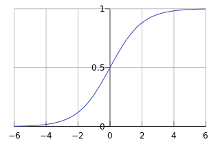
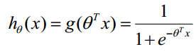
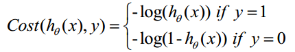

## 1. Introduction of Logistic Regression
Logistic Regression is a regression model where the dependent variable (DV) is categorical. This article covers the case of a binary dependent variable—that is, where the output can take only two values, "0" and "1". So, it can be used for clissification.

### Prediction Function
Since Logistic Regression is a clissification function, so we can use Sigmoid function to get it: 

This sigmoid functino has a "S" type line like the following picture:

In the following, in the left picture shows a line-board and in the right picture shows a none line-board.
 

For line-board, it is like the following picture:

So the Prediction Function is 

Function hθ(x) has a meaning that ratio of 1. 

 

### Loss Funtion J
Cost function and J function is like the following:

 
 

Here is how it comes:

(1) equation can be writen as: 

Get its Likelihood function:

Logarithm of Likelihood function is:

 

Then we get the largest θ
