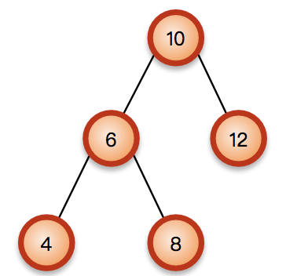
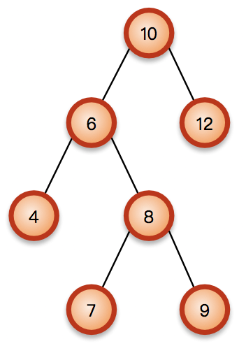
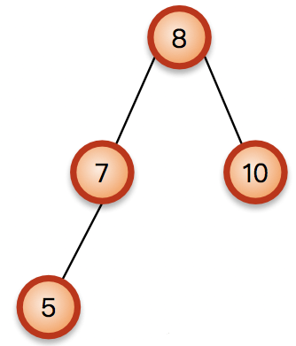
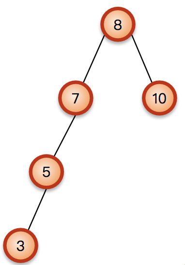
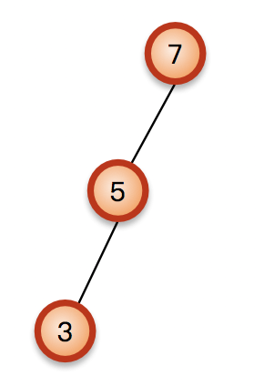
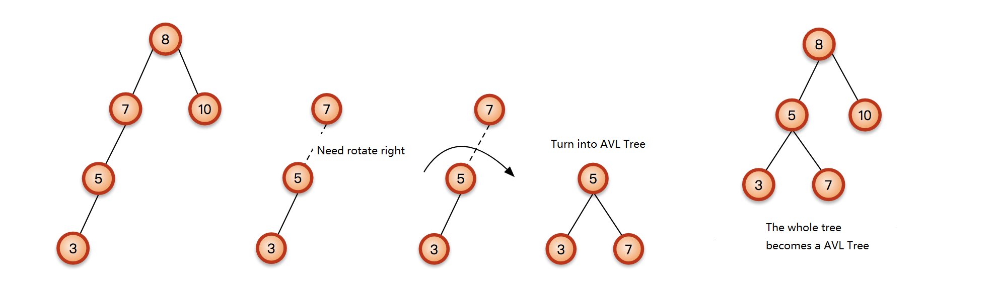
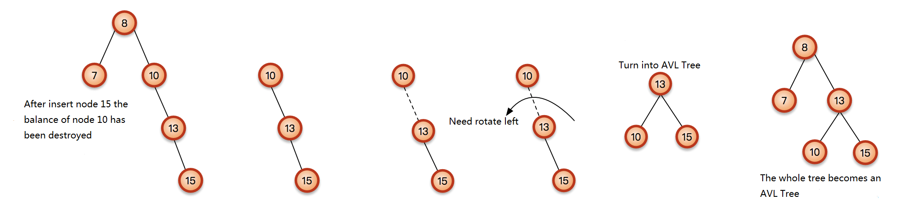
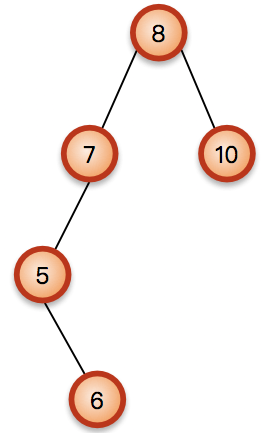
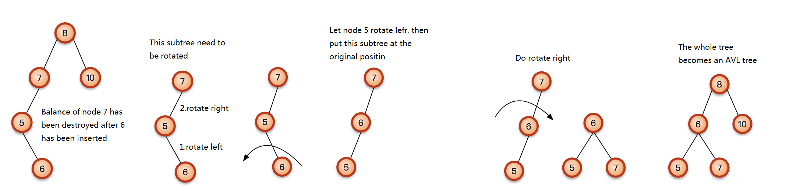

## 1. Definition of Tree
AVL Tree is a kind of Binary Search Tree that it keeps a balance which means its weight need to be kept at O(logN)

## 2. Balance Condition
The balance condition of AVL Tree is that in a binary tree the balance factor of a node N is defined to be the height difference

> BalanceFactor(N) := Height(RightSubtree(N)) – Height(LeftSubtree(N)) 

of its two child subtrees. A binary tree is defined to be an AVL tree if the invariant

> BalanceFactor(N) ∈ {–1,0,+1}

holds for every node N in the tree.

The following picture is a example of an AVL Tree:

The following picture is a example of an none AVL Tree:

## 3. Rotation
Every inserting operation may destroy the balance, so we need to do rotation to make the balance right. The aim of rotation is reducing height, it means rotate subtree with higher height to go up.

- Rotate left and torate right means use a subtree as the base point: if b is subtree of a, then rotate a around b
- If b is a left subtree of a, the around b rotate a goto right, it seems a goes down and becomes right subtree of b
- - If b is a right subtree of a, the around b rotate a goto left, it seems a goes down and becomes left subtree of b

When insert a node there are 4 kinds of situations:

Insert Type | Rotate type 
:-: | :-: 
LL | Rotate Right
RR | Rotate Left 
LR| Rotate Right After Rotate Left  
RL| Rotate Left After Rotate Right 

### 3.1 LL Rotate Right
This is a simple AVL Tree.

At this time it is in balance. If we insert a element with value of 3, the it will be like:

First of all we need to find which balance has been destroyed, the retate the tree. Since it is destroyed by node 3, so the wrong tree is from node 3 to node 8. Find the nearest node from the node 3 to do rotation, that is node 7. The height of left subtree of node 7 is 1 and that of right is -1, so it is not in balance. It needs to do rotation right. 

First, we peek the subtree:

It is not in balance apparently. This node 5 is higher, so we need to make the node 5 go up. Then the node 7 we go down to the right of node 5.

This is rotate right:

Then keep on finding, and find every node fulfill the balance condition. So the whole tree becomes an AVL Tree.

### 3.2 RR Rotate Left
It is the same as "LL Rotate Right"

### 3.3 LR Rotate Right After Rotate Left
In the first example if we insert 6 not 3, then it will be like the following:
 

Its balance has been destroyed apparently but at this time you can fix it by just rateting one time. From 6 to 7 you need do Rotate Right After Rotate Left:

### 3.4 RL Rotate Left After Rotate Right
It is the same as "LR Rotate Right After Rotate Left":

 
## 4 Code Example
First of all build a node class:

	private static class AVLNode<E>  {
	    E element;
	    AVLNode<E> left;
	    AVLNode<E> right;
	    int height;
	
	    public AVLNode(E element) {
	        this(element, null, null);
	    }
	
	    public AVLNode(E element, AVLNode<E> left, AVLNode<E> right) {
	        this.element = element;
	        this.left = left;
	        this.right = right;
	    }
	}

The build a class has insert(), remove(), height()
 
	public class MyAVLTree<E extends Comparable<E>> {
	    private AVLNode root;
	
	    public MyAVLTree() {
	        this.root = null;
	    }
	
	    public void insert(E x) {
	        root = insert(x, root);
	    }
	
	    public void remove(E x) {
	        remove(x, root);
	    }
	
	    public int height() {
	        return height(root);
	    }
	
	    public AVLNode<E> insert(E x, AVLNode<E> t) {
	        if (t == null) {
	            return new AVLNode<E>(x);
	        }
	        int compareResult = x.compareTo(t.element);
	        if (compareResult < 0) {
	            t.left = insert(x, t.left);
	            if (height(t.left) - height(t.right) == 2) {
	                if (x.compareTo(t.left.element) < 0) {
	                    t = rightRotate(t);
	                } else {
	                    t = leftAndRightRotate(t);
	                }
	            }
	        } else if (compareResult > 0) {
	            t.right = insert(x, t.right);
	            if (height(t.right) - height(t.left) == 2) {
	                if (x.compareTo(t.right.element) > 0) {
	                    t = leftRotate(t);
	                } else {
	                    t = rightAndLeftRotate(t);
	                }
	            }
	        } else {
	        }
	        t.height = Math.max(height(t.left), height(t.right)) + 1;
	        return t;
	    }
	
	    private AVLNode<E> remove(E x, AVLNode<E> t) {
	        if (t == null)
	            return null;
	        int compareResult = x.compareTo(t.element);
	        if (compareResult < 0) {
	            t.left = remove(x, t.left);
	            if (t.right != null) {     
	                if (t.left == null) {  
	                    if (height(t.right) - t.height == 2) {
	                        AVLNode<E> k = t.right;
	                        if (k.right != null) {        
	                            t = leftRotate(t);
	                        } else {                      
	                            t = rightAndLeftRotate(t);
	                        }
	                    }
	                }
	                if (t.left!=null){     
	                    AVLNode<E> k = t.left;
	                    if (k.right != null) {
	                        if (height(k.left) - height(k.right) == 2) {
	                            AVLNode<E> m = k.left;
	                            if (m.left != null) {     
	                                k = rightRotate(k);
	                            } else {                  
	                                k = leftAndRightRotate(k);
	                            }
	                        }
	                    } else {
	                        if (height(k.left) - k.height == 2) {
	                            AVLNode<E> m = k.left;
	                            if (m.left != null) {    
	                                k = rightRotate(k);
	                            } else {                    
	                                k = leftAndRightRotate(k);
	                            }
	                        }
	                    }
	                    if (height(t.right) - height(t.left) == 2) {
	                        t = leftRotate(t);
	                    }
	                }
	            }
	            t.height = Math.max(height(t.left), height(t.right)) + 1;
	        } else if (compareResult > 0) {
	            t.right = remove(x, t.right);
	            if (t.left != null) {    
	                t = balanceChild(t);
	            }
	            t.height = Math.max(height(t.left), height(t.right)) + 1;
	        } else if (t.left != null && t.right != null) {
	            AVLNode<E> min = t.right;
	            while (min.left != null) {
	                min = min.left;
	            }
	            t.element = min.element;
	            t.right = remove(t.element, t.right);
	            t = balanceChild(t);
	            
	            t.height = Math.max(height(t.left), height(t.right)) + 1;
	        } else {
	            t = (t.left != null) ? t.left : t.right;
	        }
	        return t;
	    }
	
	    private AVLNode<E> balanceChild(AVLNode<E> t) {
	        if (t.right == null) {        
	            if (height(t.left) - t.height == 2) {
	                AVLNode<E> k = t.left;
	                if (k.left != null) {
	                    t = rightRotate(t);
	                } else {
	                    t = leftAndRightRotate(t);
	                }
	            }
	        } else {              
	            AVLNode<E> k = t.right;
	
	            if (k.left != null) {
	                if (height(k.right) - height(k.left) == 2) {
	                    AVLNode<E> m = k.right;
	                    if (m.right != null) {        
	                        k = leftRotate(k);
	                    } else {                      
	                        k = rightAndLeftRotate(k);
	                    }
	                }
	            } else {
	                if (height(k.right) - k.height == 2) {
	                    AVLNode<E> m = k.right;
	                    if (m.right != null) {      
	                        k = leftRotate(k);
	                    } else {                    
	                        k = rightAndLeftRotate(k);
	                    }
	                }
	            }
	            if (height(t.left) - height(t.right) == 2) {
	                t = rightRotate(t);
	            }
	        }
	        return t;
	    }
	 
	    private AVLNode<E> rightRotate(AVLNode<E> t) {
	        AVLNode newTree = t.left;
	        t.left = newTree.right;
	        newTree.right = t;
	        t.height = Math.max(height(t.left), height(t.right)) + 1;
	        newTree.height = Math.max(height(newTree.left), height(newTree.right)) + 1;
	        return newTree;
	    }
	
	    private AVLNode<E> leftRotate(AVLNode t) {
	        AVLNode<E> newTree = t.right;
	        t.right = newTree.left;
	        newTree.left = t;
	        t.height = Math.max(height(t.left), height(t.right)) + 1;
	        newTree.height = Math.max(height(newTree.left), height(newTree.right)) + 1;
	        return newTree;
	    }
	
	    private AVLNode<E> leftAndRightRotate(AVLNode<E> t) {
	        t.left = leftRotate(t.left);
	        return rightRotate(t);
	    }
	
	    private AVLNode<E> rightAndLeftRotate(AVLNode<E> t) {
	        t.right = rightRotate(t.right);
	        return leftRotate(t);
	    }
	
	    private int height(AVLNode<E> t) {
	        return t == null ? -1 : t.height;
	    }
	
	    public void printTree() {
	        printTree(root);
	    }
	
	    private void printTree(AVLNode<E> tree) {
	        if (tree == null) {
	            return;
	        }
	        System.out.print(tree.element + " ");
	        printTree(tree.left);
	        printTree(tree.right);
	
	    }
	
	    private static class AVLNode<E> {
	        E element;
	        AVLNode<E> left;
	        AVLNode<E> right;
	        int height;
	
	        public AVLNode(E element) {
	            this(element, null, null);
	        }
	
	        public AVLNode(E element, AVLNode<E> left, AVLNode<E> right) {
	            this.element = element;
	            this.left = left;
	            this.right = right;
	        }
	    }
	}

Then test the function:

	public static void main(String[] args) {
	    MySearchTree<Integer> searchTree = new MySearchTree<>();
	    for (int i = 0; i < 10; i++) {
	        searchTree.insert(i);
	    }
	    MyAVLTree<Integer> avlTree = new MyAVLTree<>();
	    for (int i = 0; i < 10; i++) {
	        avlTree.insert(i);
	        System.out.println("insert"+i+" then the height of tree is" + avlTree.height());
	    }
	    System.out.println("search order:");
	    searchTree.printTree();
	    System.out.println();
	    System.out.println("AVL search orderf:");
	    avlTree.printTree();
	}

