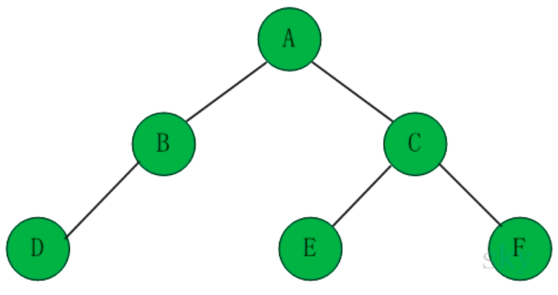
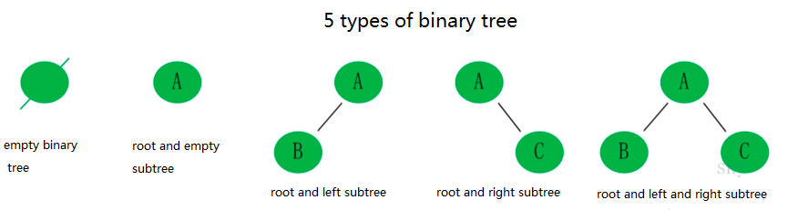
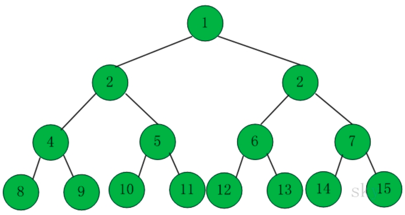
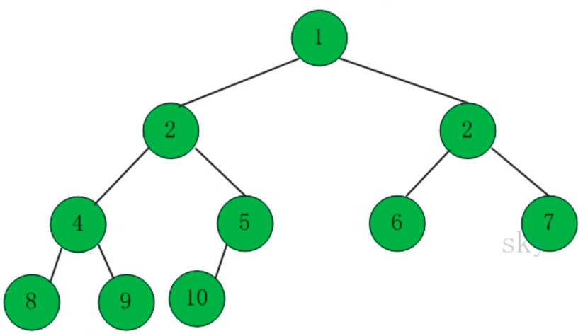

## 1. Definition of Tree
Tree is a kind of data structure and it is constructed by n(n>=1) nodes to form a relationship with some layouts.

There are some characters in Tree:

- every node has 0 or more than 0 node
- node with no father node is the root node
- every node except the root node has a father node
- every node excepy the root node can divide into more than one subtree.

## 2. Binary Tree
### 2.1 Definition of Binary Tree
Binary tree is a kind of tree than its number of subtree is less than 2 for every node.

### 2.2 Character of Binary Tree
- The largest number at the ith layout is 2i-1(i>=1)
- Binary tree that its height is k has less than  2k-1 nodes
- Binary tree that has n nodes has a height at least (log2n)+1

## 3. Full Binary Tree
A binary tree that its weight is h and number of its node is 2h-1,then it is a Full Binary Tree 

## 4. Complete Binary Tree
A Binary Tree is complete Binary Tree if all levels are completely filled except possibly the last level and the last level has all keys as left as possible. 

