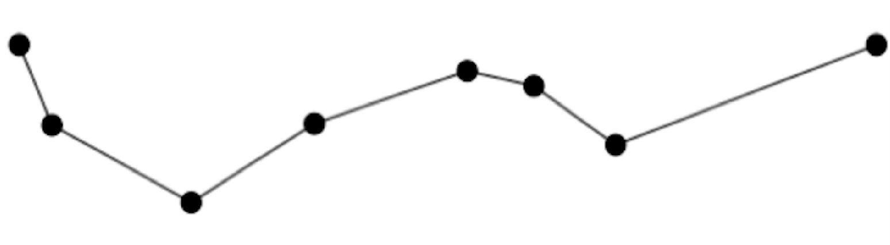
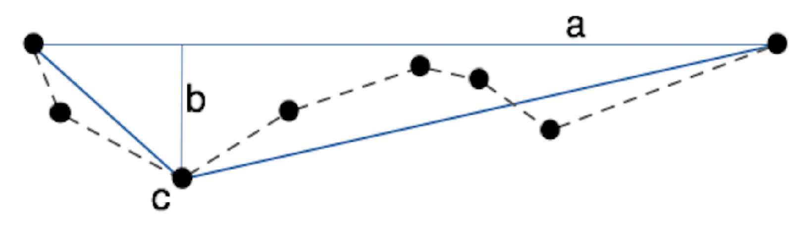
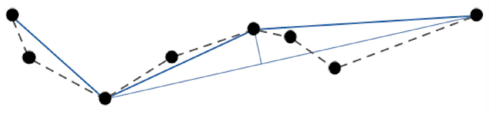
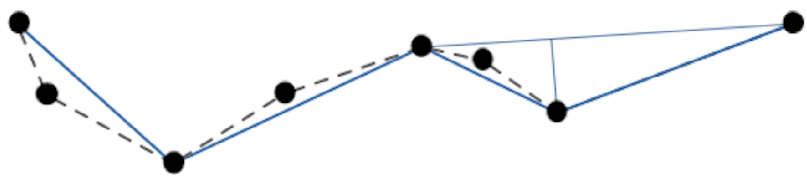
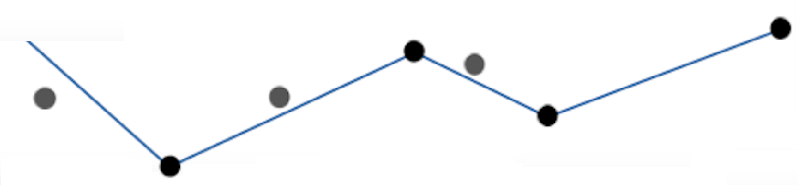

## 1. Introduction of Uniform Sampling
One original trajectory data consisting of a series of time-stamped n points (x, y, t) (x and y are coordinate and t is the time), the ith point is kept in the compressed version, for some suitable integer i. The primary advantage of Uniform Sampling [2] is that it runs in linear time, and is trivial to implement. The major disadvantage is drastic changes in speed and direction are not stored if the change occurs between sampled points. 

Uniform Sampling is a trivial compression strategy that simply takes every ith point in the trajectory. It therefore executes in linear time. However, the algorithm can easily miss sharp changes in speed and direction if the sampling rate is too large.

## 2. Douglas-Peucker

To solve the problem of uniform sampling algorithm, Douglas-Peucker is provided. The Douglas-Peucker algorithm simplifies a polyline by removing vertices that do not contribute sufficiently to the overall shape. The amount a point may deviate before it is excluded is an input to the algorithm, and naturally will impact the number of points that are excluded. Here is an example.

There are original trajectory data with 8 points in the following picture.

it uses the first and last point to make the baseline and computes the distance between others points and baseline. If the largest distance is bigger than a threshold, then the point will be the pivot.

The original trajectory is divided by the pivot. Do the same thing in each part.

Do the same thing recursively. 

Then we get the result.

Finally, we can get the simplified trajectory

***
#### Algorithm Douglas-Peucker
***
Find the point X furthest from the baseline and its distance from baseline 
if dist ≥ tolerance then 
&nbsp;&nbsp; Douglas-Peucker(V,a,pivot) 
&nbsp;&nbsp; Douglas-Peucker(V,pivot,b)
else 
&nbsp;&nbsp; Output(Va,Vb) end if
***

Begin with the first and last points in the path and we call them A and B. These are always kept and use the two points to make a base line. Find the point X between the first and last that is furthest away from the base line. If this point is greater than the allowed tolerance, this point is kept. We call the point is pivot. Repeat this algorithm twice: once using A as the first point and pivot as the last point, the other time using pivot as the first point and B as the last point. Now we will analyse the problem of Douglas-peucker. If we get the pivot at the most oneside (right or left) everytime, it works as follows: First , we get a pivot which at the most leftside (or rightside) and there is n−1 point left which needs to compute later. Second , we we get a pivot which at the most leftside (or rightside) and there is n−2 point left which needs to compute later. In this way, the recursion will do n times. So in this case the whole computation is (n−1) + (n−2) + ... + (1) = O(n2). That is to say the worst-case is O(n2).

## 2. Douglas-Peucker ++
The problem of the Douglas-Peucker is that we may get the pivot which is at most leftside(or rightside). To avoid this problem, Douglas+ is provided. Douglas+ works as follows: 
> Begin with the first and last points in the path and we call them A and B. These are always kept and use the two point to make a bese line. Find all points between the first and last that distance from the point to the base line is greater than the allowed tolerance as candidate point. We choose the most middle point as from candidate point the pivot. Repeat this algorithm twice: once using A as the first point and pivot as the last point, the other time using pivot as the first point and B as the last point.

***
#### Algorithm Douglas+
***
Find the point set X from the baseline which can be pivot and is in the most middle point 
if the point X exist then 
&nbsp;&nbsp; Douglas+(V,a,pivot) 
&nbsp;&nbsp; Douglas+(V,pivot,b)
else
&nbsp;&nbsp; Output(Va,Vb)
end if
***

Like the Douglas-Peucker, the worst-case of Douglas+ is that If we get the pivot at the most oneside (right or left) everytime, it works as follows: 

First time, we get a pivot which at the most leftside (or rightside) and there is n-1 point left which needs to compute later.

Second time, we we get a pivot which at the most leftside (or rightside) and there is n-2 point left which needs to compute later. 

In this way, the recursion will do n times. So in this case the whole computation is (n−1) + (n−2) + ... + (1) = O(n2). That is to say that although Douglas+ can avoid the problem of Douglas-peucker in high probability,it still may become O(n2) which is the same problem with Douglas-Peucker.

