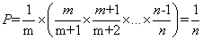

## 1. Introduction of Reservoir Sampling
Reservoir sampling is a technique to enable a representative sample of a large dataset to be taken. It can be used in cases where the size of the dataset is unknown and it uses very little of the processor’s memory as only the sample needs to be stored. Each entity is processed one at a time and is either added to the sample or rejected, this makes it ideal for sampling a steam of data.

## 2. Algorithm
We want to pick a element at the ratio of 1/n when we have n elements. So, the ratio of mth element to be chosen is like the following picture

For Reservoir Sampling, it is the same:

## 3. Code Example

	public class ReservoirSampling {   
	    public static void main(String[] args) {  
	        int k=100;  
	        int n=1000;  
	        int[] data=new int[n];  
	        for(int i=0;i<n;i++){  
	            data[i]=i;  
	        }  
	        int[] sample=reservoirSampling(data,k);  
	        System.out.println(Arrays.toString(sample));  
	    }  
	      
	    public static int[] reservoirSampling(int[] data,int k){  
	        if(data==null){  
	            return new int[0];//In <Effective Java>,it advises to return int[0] instead of null.Am i doing right in this case?  
	        }  
	        if(data.length<k){  
	            return new int[0];  
	        }  
	        int[] sample=new int[k];  
	        int n=data.length;  
	        for(int i=0;i<n;i++){  
	            if(i<k){  
	                sample[i]=data[i];  
	            }else{  
	                int j=new Random().nextInt(i);  
	                if(j<k){  
	                    sample[j]=data[i];  
	                }  
	            }  
	        }  
	        return sample;  
	    }  
	}  