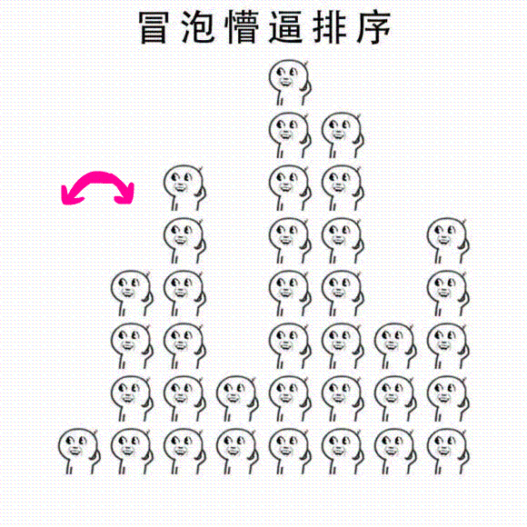

## Introduction
I copy introduction of it from [wiki](https://en.wikipedia.org/wiki/Bubble_sort).

>Bubble sort, sometimes referred to as sinking sort, is a simple sorting algorithm that repeatedly steps through the list to be sorted, compares each pair of adjacent items and swaps them if they are in the wrong order. The pass through the list is repeated until no swaps are needed, which indicates that the list is sorted. The algorithm, which is a comparison sort, is named for the way smaller or larger elements "bubble" to the top of the list. Although the algorithm is simple, it is too slow and impractical for most problems even when compared to insertion sort. Bubble sort can be practical if the input is in mostly sorted order with some out-of-order elements nearly in position.

## Example
I found an interesting gif which shows how bubble sort works:

## Code

Here is an example code:

	public class BubbleSort {
	    public static void main(String[] args) {
	        int[] arr = {5, 3, 4, 2, 1,9,8,7};
	        bubbleSort(arr);
	        print(arr);
	    }
	    public static void bubbleSort(int[] arr) {
	        for (int i = 0; i < arr.length - 1; i++) {
	            for (int j = 0; j < arr.length - 1 - i; j++) {
	                if(arr[j] > arr[j+1]) {
	                    swap(arr,j,j+1);
	                }
	            }
	        }
	    }
	    public static void print(int[] arr) {
	        for (int i = 0; i < arr.length; i++) {
	            System.out.print(arr[i] + "");
	        }
	    }
	
	    private static void swap(int[] arr,int i,int j) {
	        int temp = arr[i];
	        arr[i] = arr[j];
	        arr[j] = temp;
	    }
	}

The result will be:

	12345789