## Introduction
The main idea of this algorithm is(copy from [wiki](https://en.wikipedia.org/wiki/Heapsort)):

- a heap is built out of the data. The heap is often placed in an array with the layout of a complete binary tree. The complete binary tree maps the binary tree structure into the array indices; each array index represents a node; the index of the node's parent, left child branch, or right child branch are simple expressions. For a zero-based array, the root node is stored at index 0; if i is the index of the current node, then

>  iParent(i)     = floor((i-1) / 2) where floor functions map a real number to the smallest leading integer.
>  iLeftChild(i)  = 2*i + 1
>  iRightChild(i) = 2*i + 2

-  a sorted array is created by repeatedly removing the largest element from the heap (the root of the heap), and inserting it into the array. The heap is updated after each removal to maintain the heap property. Once all objects have been removed from the heap, the result is a sorted array.

## Example
We have a array which is [16,7,3,20,17,8] that needs to be sorted. First of all, we get a Complete Binary Tree of it.

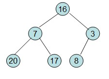

##### 1.Initial the heap
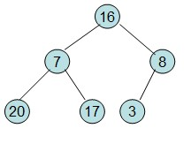
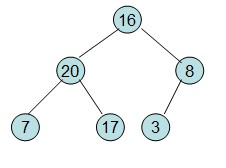
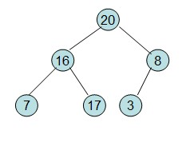

After exchanging with 20 and 16, it is not satified with the heap condition, so it need reheap
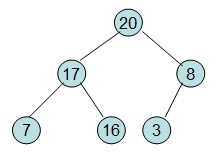

Then,we get a initial heap.

##### 2.The top element R[1] exchanges with the last element R[n]
 
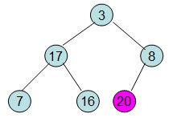

##### 3.Reheap
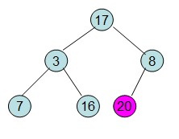
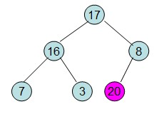

##### Redo the operation above

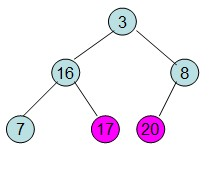
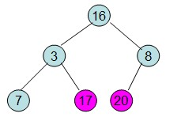
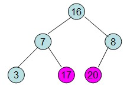
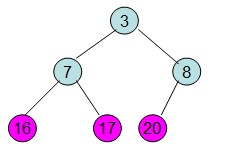
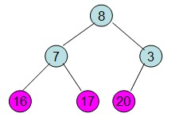
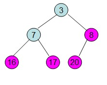
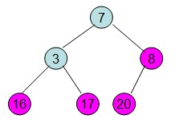
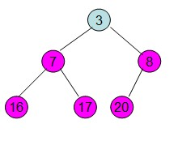 

Finally, we sort the array successfully.

## Code

Here we have a example code:

	public class HeapSort {
	    public static void main(String[] args) {
	        int a[] = {3,1,5,7,2,4,9,6,10,8};
	        HeapSort  obj=new HeapSort();
	        System.out.println("Initial value:");
	        obj.print(a);
	
	        for(int i=0;i<a.length;i++){
	            obj.createLittleHeap(a,a.length-1-i);
	            obj.swap(a, 0, a.length - 1 - i);
	            obj.print(a);
	            System.out.println();
	        }
	        System.out.println("\nAfter sort:");
	        obj.print(a);
	    }
	
	    private void createLittleHeap(int[] data, int last) {
	        for (int i = (last- 1) / 2; i >= 0; i--) {
	            int parent = i;
	            while (2 * parent + 1 <= last) {
	                int bigger = 2 * parent + 1;
	                if (bigger < last) {
	                    if (data[bigger] > data[bigger+ 1]) {
	                        bigger=bigger+1;
	                    }
	                }
	                if (data[parent] > data[bigger]) {
	                    swap(data, parent, bigger);
	                    parent = bigger;
	                } else {
	                    break;
	                }
	            }
	        }
	    }
	    public void print(int a[]){
	        for(int i=0;i<a.length;i++){
	            System.out.print(a[i]+" ");
	        }
	    }
	    public  void swap(int[] data, int i, int j) {
	        if (i == j) {
	            return;
	        }
	        data[i] = data[i] + data[j];
	        data[j] = data[i] - data[j];
	        data[i] = data[i] - data[j];
	    }
	}

The result will be:

	Initial value:
	3 1 5 7 2 4 9 6 10 8 8 2 4 6 3 5 9 7 10 1 
	10 3 4 6 8 5 9 7 2 1 
	10 6 4 7 8 5 9 3 2 1 
	9 6 5 7 8 10 4 3 2 1 
	10 6 9 7 8 5 4 3 2 1 
	8 7 9 10 6 5 4 3 2 1 
	10 8 9 7 6 5 4 3 2 1 
	9 10 8 7 6 5 4 3 2 1 
	10 9 8 7 6 5 4 3 2 1 
	10 9 8 7 6 5 4 3 2 1 
	
	After sort:
	10 9 8 7 6 5 4 3 2 1 
