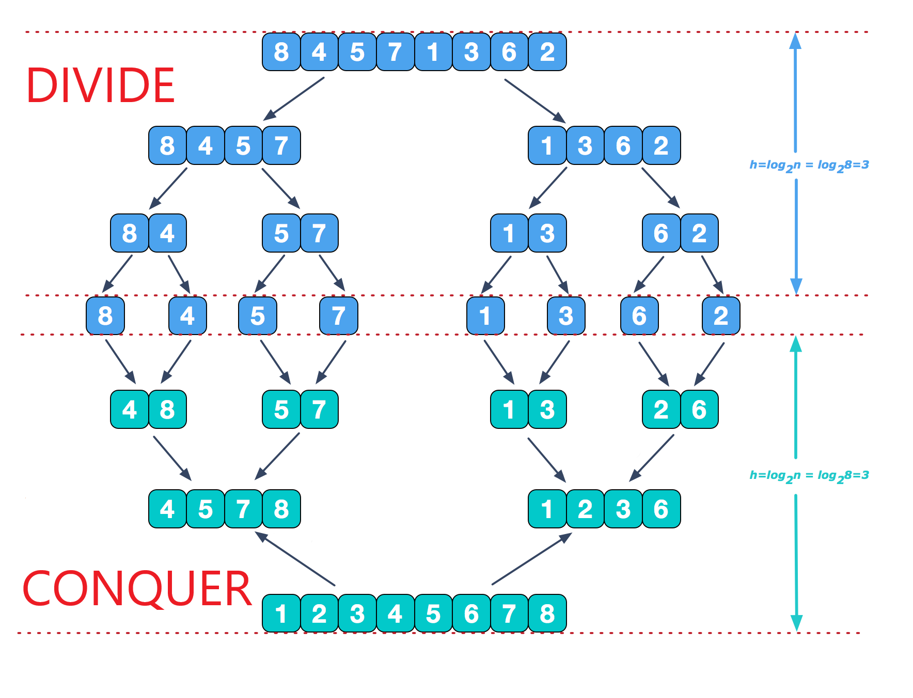

## Introduction
I copy an introduction of it from [wiki](https://en.wikipedia.org/wiki/Merge_sort)

>n computer science, merge sort (also commonly spelled mergesort) is an efficient, general-purpose, comparison-based sorting algorithm. Most implementations produce a stable sort, which means that the implementation preserves the input order of equal elements in the sorted output. Mergesort is a divide and conquer algorithm that was invented by John von Neumann in 1945. A detailed description and analysis of bottom-up mergesort appeared in a report by Goldstine and von Neumann as early as 1948.

The following picture will show you how it works:

## Code
Here is an example code:

	public class MergeSortTest {
	    public static void main(String[] args) {
	        int[] data = new int[] { 5, 3, 6, 2, 1, 9, 4, 8, 7 };
	        print(data);
	        mergeSort(data);
	        System.out.println("After sort:");
	        print(data);
	    }
	
	    public static void mergeSort(int[] data) {
	        sort(data, 0, data.length - 1);
	    }
	
	    public static void sort(int[] data, int left, int right) {
	        if (left >= right)
	            return;
	        int center = (left + right) / 2;
	        sort(data, left, center);
	        sort(data, center + 1, right);
	        merge(data, left, center, right);
	        print(data);
	    }
	
	    public static void merge(int[] data, int left, int center, int right) {
	        int[] tmpArr = new int[data.length];
	        int mid = center + 1;
	        int third = left;
	        int tmp = left;
	        while (left <= center && mid <= right) {
	            if (data[left] <= data[mid]) {
	                tmpArr[third++] = data[left++];
	            } else {
	                tmpArr[third++] = data[mid++];
	            }
	        }
	        while (mid <= right) {
	            tmpArr[third++] = data[mid++];
	        }
	        while (left <= center) {
	            tmpArr[third++] = data[left++];
	        }
	        while (tmp <= right) {
	            data[tmp] = tmpArr[tmp++];
	        }
	    }
	
	    public static void print(int[] data) {
	        for (int i = 0; i < data.length; i++) {
	            System.out.print(data[i] + "\t");
	        }
	        System.out.println();
	    }
	}

The result will be:
	
	5	3	6	2	1	9	4	8	7	
	3	5	6	2	1	9	4	8	7	
	3	5	6	2	1	9	4	8	7	
	3	5	6	1	2	9	4	8	7	
	1	2	3	5	6	9	4	8	7	
	1	2	3	5	6	4	9	8	7	
	1	2	3	5	6	4	9	7	8	
	1	2	3	5	6	4	7	8	9	
	1	2	3	4	5	6	7	8	9	
	After sort:
	1	2	3	4	5	6	7	8	9