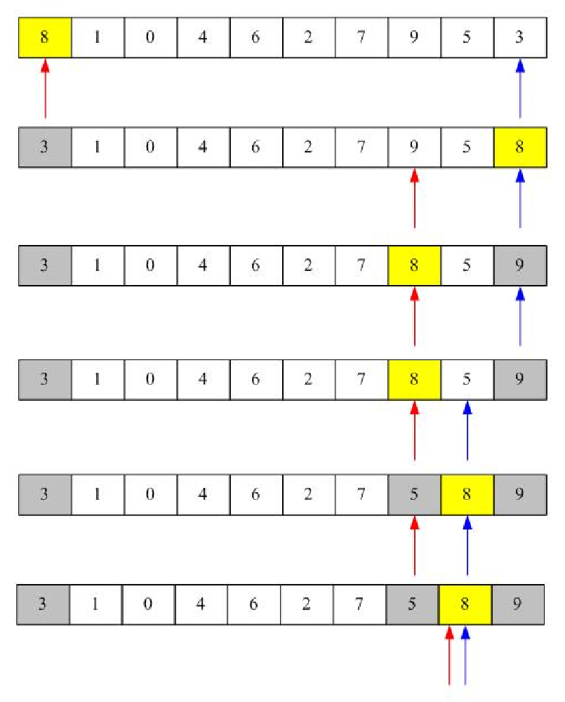

## Introduction
The quicksort algorithm sorts an unordered list based on the divide and conquer strategy. It divides the unordered list into two sub-lists: low elements sub-list and high elements sub-list, and then recursively sort these sub-lists. How the quicksort algorithm works will be described in the follows:

1. Pick an element from the list, which is called a pivot.
2. Reorder the list with a rule that all elements which are less than the pivot come before the pivot, whereas all elements that are higher than the list come after the pivot. After partitioning the list, the pivot is in its position.With the two sub-lists, apply the above steps recursively.

>V is the unordered list and choose X as pivot and let all elements that less than X is a and others are b >Quicksort(V,a,pivot) 
>Quicksort(V,pivot,b)

This picuture shows how quicksort make low elements sub-list and high elements sub-list. The number with yellow backgroud is pivot. The red arrow is the left side where has been reached and the blue arrow is the right side where has been reached.

- First Pick an element called a pivot from the array. In Fig. 3.3, 8 is chosed as pivot.
- Second Reorder the array so that all elements with values less than the pivot come before the pivot, while all elements with values greater than the pivot come after it. After this partitioning, the pivot is in its final position. This is called the partition operation.
- Third Recursively apply the above steps to the sub-array of elements with smaller values and separately to the sub-array of elements with greater values.

In both best and average cases are O(nlogn) where n is the number of unsorted elements. While, if the input is already ordered list, the complexity of the quicksort algorithm in the worst case is O(n2).

## Code
Here is an example code:
	
	public class QuickSort {
	    public static void main(String[] args) {
	        int a[] = {3,1,5,7,2,4,9,6,10,8};
	        QuickSort  obj=new QuickSort();
	        System.out.println("Initial value:");
	        obj.print(a);
	        int h=a.length-1;
	        obj.quickSort(a,0,h);
	        System.out.println("\nAfter sort:");
	        obj.print(a);
	    }
	    private  void quickSort(int[] a,int low, int high) {
	        if(low<high){
	            int middle=getMiddle(a,low,high);
	            quickSort(a,  0,  middle-1);
	            quickSort(a,   middle + 1, high);
	        }
	    }
	    public int getMiddle(int[] a, int low, int high){
	        int key = a[low];
	        while(low<high){
	            while(low<high && a[high]>=key){
	                high--;
	            }
	            a[low]=a[high];
	            while(low<high && a[low]<=key){
	                low++;
	            }
	            a[high]=a[low];
	        }
	        a[low]=key;
	        return low;
	    }
	    public void print(int a[]){
	        for(int i=0;i<a.length;i++){
	            System.out.print(a[i]+" ");
	        }
	    }
	}

The result will be:
	
	Initial value:
	3 1 5 7 2 4 9 6 10 8 
	After sort:
	1 2 3 4 5 6 7 8 9 10