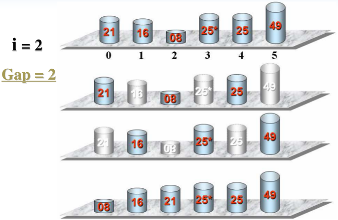

## Introduction
It will split a data set that need to be sorted into several  parts and sort every part by using insert sort. Do there again until all the data has been sorted. The following picture will show you the detail:

It is faster than insert sort.

## Code
Here is the example code:

	public class ShellSort {
	    public static void main(String[] args) {
	        int a[] = {5,1,3,7,2,4,9,6,10,8};
	        ShellSort  obj=new ShellSort();
	        System.out.println("Initial value ：");
	        obj.print(a);
	        obj.shellSort(a);
	        System.out.println("\nAfter sort：");
	        obj.print(a);
	
	    }
	    private void shellSort(int[] a) {
	        int dk = a.length/2;
	        while( dk >= 1  ){
	            ShellInsertSort(a, dk);
	            dk = dk/2;
	        }
	    }
	    private void ShellInsertSort(int[] a, int dk) {
	        for(int i=dk;i<a.length;i++){
	            if(a[i]<a[i-dk]){
	                int j;
	                int x=a[i];//x is the value wait to be inserted
	                a[i]=a[i-dk];
	                for(j=i-dk;  j>=0 && x<a[j];j=j-dk){
	                    a[j+dk]=a[j];
	                }
	                a[j+dk]=x;//insert
	            }
	        }
	    }
	    public void print(int a[]){
	        for(int i=0;i<a.length;i++){
	            System.out.print(a[i]+" ");
	        }
	    }
	}

The result will be:

	Initial value ：
	3 1 5 7 2 4 9 6 10 8 
	After sort：
	1 2 3 4 5 6 7 8 9 10 