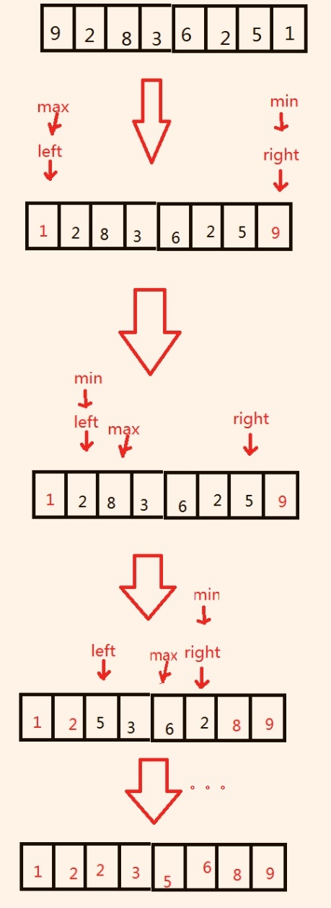

## Introduction

It will a smallest(or biggest) value and replace it at the first place, then do it again in the left data set and replace it at the second place. Do it until n-1th and nth data has been replaced.  

The following picture will show you this

## Code
Here is an example code:

	public class SimpleSelectSort {
	    public static void main(String[] args) {
	        int a[] = {3,1,5,7,2,4,9,6,10,8};
	        SimpleSelectSort  obj=new SimpleSelectSort();
	        System.out.println("Initail value：");
	        obj.print(a);
	        obj.selectSort(a);
	        System.out.println("\nAfter sort：");
	        obj.print(a);
	
	    }
	    private void selectSort(int[] a) {
	        for(int i=0;i<a.length;i++){
	            int k=i;
	            for(int j=i+1;j<a.length;j++){
	                if(a[k]>a[j])
	                    k=j;
	            }
	            swap(a,k,i);
	        }
	    }
	    public void print(int a[]){
	        for(int i=0;i<a.length;i++){
	            System.out.print(a[i]+" ");
	        }
	    }
	    public  void swap(int[] data, int i, int j) {
	        if (i == j) {
	            return;
	        }
	        data[i] = data[i] + data[j];
	        data[j] = data[i] - data[j];
	        data[i] = data[i] - data[j];
	    }
	}

The result will be:

	Initail value：
	3 1 5 7 2 4 9 6 10 8 
	After sort：
	1 2 3 4 5 6 7 8 9 10 