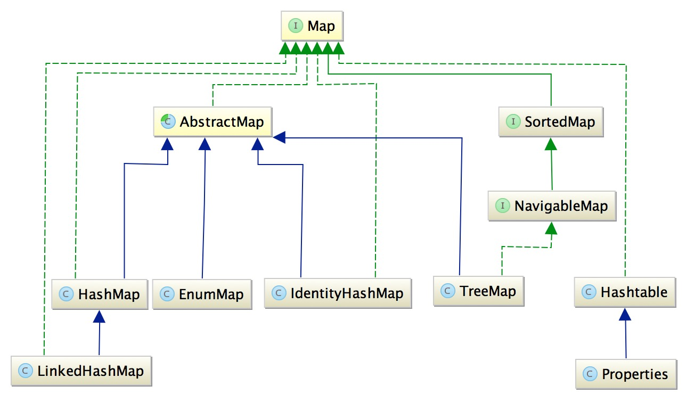

# Basic Conception
## Basic Architecture
About architecture of collection, showed int the following picture: 

About architecture of Map, showed in the following picture:

As the pictures say, all collections extend Collection class and all maps extend Map class. 
The following chapters will show you the detail interface.  
 