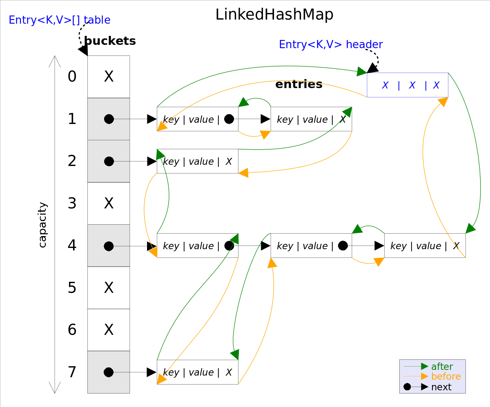
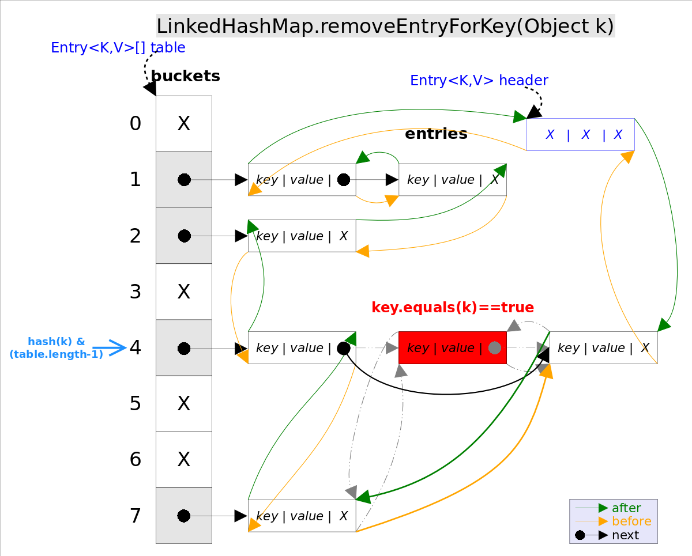

# LinkedHashMap and LinkedHashSet
## Introduction of LinkedHashMap
HashMap is unordered, which means the order of get() may not the same as the order of put(). Here is a example:
 
	public static void main(String[] args) {
	    Map<String, String> map = new HashMap<String, String>();
	    map.put("apple", "リンゴ");
	    map.put("watermelon", "スイカ");
	    map.put("banana", "バナナ");
	    map.put("peach", "モモ");
	
	    Iterator iter = map.entrySet().iterator();
	    while (iter.hasNext()) {
	        Map.Entry entry = (Map.Entry) iter.next();
	        System.out.println(entry.getKey() + "=" + entry.getValue());
	    }
	}

And the outcome is:

	banana=バナナ
	apple=リンゴ
	peach=モモ
	watermelon=スイカ

If you implement map by using LinkedHashMap which is "Map<String, String> map = new LinkedHashMap<String, String>();", then the outcome will be:

	apple=リンゴ
	watermelon=スイカ
	banana=バナナ
	peach=モモ

You can see that the order of outcome is the order of put(). How nice! In fact, you can get a order of get(). I will explain it latter. Now, I will show you a picture of architecture of LinkedHashMap:

LinkedHashMap is subclass of HashMap, the only different point is that LinkedHashMap implements a linkedlist on every entry of HashMap, that is for ordering. Here a picture about Entry:

So, LinkedHashMap has some charaters like HashMap like:

- key can be null and can not be duplicated
- value can be null and can be duplicated
- it is not thread safe

## Implementation of LinkedHashMap
##### Member Variables
LinkedHashMap use hash algorithm which is the same to HashMap, but it redifined Entry as I have showed in the picture. Here is the source code of Entry:

	/**
	* The iteration ordering method for this linked hash map: <tt>true</tt>
	* for access-order, <tt>false</tt> for insertion-order.
	* if true, then order as get,if flase, then order as put
	*/
	private final boolean accessOrder;
	/**
	* head of double list
	 */
	private transient Entry<K,V> header;
	
	/**
	* element of Entry of LinkedHashMap
	* it extends Hashmap and add before and after
	 */
	private static class Entry<K,V> extends HashMap.Entry<K,V> {
	    Entry<K,V> before, after;
	    ……
	}

##### Initialization
From the source code, we can know that in the contructor of LinkedHashMap, it uses the super() which is the constructor of HashMap to construct a table array, and adds a variables named accessOrder which its default value is false. If value of accessOrder is true it means the order of element is get(), if value of accessOrder is flase it means the order of element is put(). Here is the source code:

	public LinkedHashMap(int initialCapacity, float loadFactor,boolean accessOrder) {
		super(initialCapacity, loadFactor);
		this.accessOrder = accessOrder;
	}

As we know, Entry of LinkedHashMap entends from Entry of HashMap and has function of double linkedlist. In the constructor of HashMap, it will invokes init() finally. This function is not meanningful if implemented in HashMap. So, in LinkedHashMap, init() is overrided. Here is the source code:

	/**
	* Called by superclass constructors and pseudoconstructors (clone,
	* readObject) before any entries are inserted into the map.  Initializes
	* the chain.
	*/
	@Override
	void init() {
	  header = new Entry<>(-1, null, null, null);
	  header.before = header.after = header;
	}

##### Storage
LinkedHashMap didn't override put() of HashMap, but overrides subfunctions of put() that are "void recordAccess(HashMap m)", "void addEntry(int hash, K key, V value, int bucketIndex)" and "void createEntry(int hash, K key, V value, int bucketIndex)". They provide implementation of double linkedlist. Here is the source code of HashMap：

		public V put(K key, V value) {
	        if (key == null)
	            return putForNullKey(value);
	        int hash = hash(key);
	        int i = indexFor(hash, table.length);
	        for (Entry<K,V> e = table[i]; e != null; e = e.next) {
	            Object k;
	            if (e.hash == hash && ((k = e.key) == key || key.equals(k))) {
	                V oldValue = e.value;
	                e.value = value;
	                e.recordAccess(this);
	                return oldValue;
	            }
	        }
	
	        modCount++;
	        addEntry(hash, key, value, i);
	        return null;
		}
	
And the overrided function is:
	
	void recordAccess(HashMap<K,V> m) {
	    LinkedHashMap<K,V> lm = (LinkedHashMap<K,V>)m;
	    if (lm.accessOrder) {
	        lm.modCount++;
	        remove();
	        addBefore(lm.header);
	        }
	}
	
	void addEntry(int hash, K key, V value, int bucketIndex) {
	    // when invoke create(), new element will be put into double linked list
	    createEntry(hash, key, value, bucketIndex);
	
	    // strategy of deleting the most useless elements recently
	    Entry<K,V> eldest = header.after;
	    if (removeEldestEntry(eldest)) {
	        removeEntryForKey(eldest.key);
	    } else {
	        if (size >= threshold)
	            resize(2 * table.length);
	    }
	}
	
	void createEntry(int hash, K key, V value, int bucketIndex) {
	    HashMap.Entry<K,V> old = table[bucketIndex];
	    Entry<K,V> e = new Entry<K,V>(hash, key, value, old);
	    table[bucketIndex] = e;
		// when invoke addBrefore(), it will be ut into hash and double linked list
	    e.addBefore(header);
	    size++;
	}
	
	private void addBefore(Entry<K,V> existingEntry) {
	    after  = existingEntry;
	    before = existingEntry.before;
	    before.after = this;
	    after.before = this;
	}

Here this picture will show you the architecture when addEntry():

##### Remove
"remove(Object key)" is used for delete entry of one key. The logic of This function is implemented in "removeEntryForKey(Object key)". "removeEntryForKey()" will find entry by using on key and delete the entry, it is like get().  
There 2 means of delete:

- For table, it needs to delete this entry from bucket
- For header, it needs to delete this entry from double linked list  

The source code of removeEntryForKey() is here:

	// LinkedHashMap.removeEntryForKey()，delete one entry of one key
	final Entry<K,V> removeEntryForKey(Object key) {
	    ......
	    int hash = (key == null) ? 0 : hash(key);
	    int i = indexFor(hash, table.length);// hash&(table.length-1)
	    Entry<K,V> prev = table[i];// get table
	    Entry<K,V> e = prev;
	    while (e != null) {// iterate the table
	        Entry<K,V> next = e.next;
	        Object k;
	        if (e.hash == hash &&
	            ((k = e.key) == key || (key != null && key.equals(k)))) {// find the entry needs to be deleted
	            modCount++; size--;
	            // 1. delete e from the bucket
	            if (prev == e) table[i] = next;
	            else prev.next = next;
	            // 2. delete e from the double linked list
	            e.before.after = e.after;
	            e.after.before = e.before;
	            return e;
	        }
	        prev = e; e = next;
	    }
	    return e;
	}

##### Get
LinkedHashMap overrides get() of HashMap, when get element after invoke getEntry(), then judge the accessOrder. When it is true, it will record order of get and will set the element to the head of double linked list and delete the element at the old position after invoke get(). Due to add() and delete() of linked list is O(1), so there is no problem of performance. Here is the source code:
	
	public V get(Object key) {
	    // invoke getEntry() of super class to get element
	    Entry<K,V> e = (Entry<K,V>)getEntry(key);
	    if (e == null)
	        return null;
	    // record order of get()
	    e.recordAccess(this);
	    return e.value;
	}
	
	void recordAccess(HashMap<K,V> m) {
	    LinkedHashMap<K,V> lm = (LinkedHashMap<K,V>)m;
	    // if order of access of LinkedHashMap has been defined, the delete element of this position and add this element to the head of linked list
	    if (lm.accessOrder) {
	        lm.modCount++;
	        remove();
	        addBefore(lm.header);
	    }
	}
	
	/**
	* Removes this entry from the linked list.
	*/
	private void remove() {
	    before.after = after;
	    after.before = before;
	}
	
	/**clear linked list，set header as initial status*/
	public void clear() {
	 super.clear();
	 header.before = header.after = header;
	}

##### Order Pattern
LinkedHashMap defines accessOrder which is a boolean variable. It is true for get order and flase for input order. The default value is flase. 
There constructors will define default order pattern. If you want to construct a LinkedHashMap and want to hava a order from recently access less to recently access more to store data, then use the following contructor: "LinkedHashMap：public LinkedHashMap(int initialCapacity, float loadFactor, boolean accessOrder)".     

