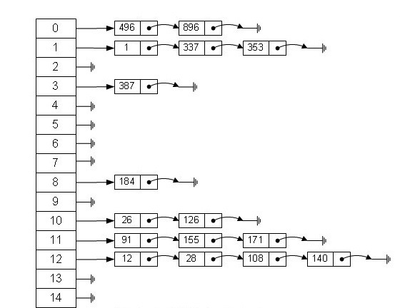

# Map
Map uses key-value type. Keys of Map can not be duplicated and each key can lead to a value.

## 2 HashMap
### 2.1 Introduction of HashMap
HashMap is based on Hash Table and implements Map interface. HashMap allows null key and null value. But, it does not make sure order especially it can not make sure order never be changed. 
Persuming hash function puts elements equably into each bucket. If performance of iterator is important for you, do not set the initial capacity too high (or the load factor too low). You may do not understand why, I will explain it latter. 
By the way, HashMap is not thread safe.

### 2.2 Data Structure
In java language, there are two basic data structure: array and pointer and HashMap use both of them. In fact, HashMap is hash linked list sctucture which means is combined with array and linked list. 

From the picture we can see that the basic structure is array and every element of the array is a linked list. So, when initiate a new HashMap, it will create a new array.  
Here is the source code:

	public HashMap(int initialCapacity, float loadFactor) {
        if (initialCapacity < 0)
            throw new IllegalArgumentException("Illegal initial capacity: " +
                                               initialCapacity);
        if (initialCapacity > MAXIMUM_CAPACITY)
            initialCapacity = MAXIMUM_CAPACITY;
        if (loadFactor <= 0 || Float.isNaN(loadFactor))
            throw new IllegalArgumentException("Illegal load factor: " +
                                               loadFactor);

        // Find a power of 2 >= initialCapacity
        int capacity = 1;
        while (capacity < initialCapacity)
            capacity <<= 1;

        this.loadFactor = loadFactor;
        threshold = (int)Math.min(capacity * loadFactor, MAXIMUM_CAPACITY + 1);
        table = new Entry[capacity];
        useAltHashing = sun.misc.VM.isBooted() &&
                (capacity >= Holder.ALTERNATIVE_HASHING_THRESHOLD);
        init();
	}

In the source code, there is a code like "table = new Entry[capacity];". That is the way how java create an array. That means in the construction function, create a Entry array with defined capacity. So, what is the structure of Entry? Let's see the source code:

	static class Entry<K,V> implements Map.Entry<K,V> {
	    final K key;
	    V value;
	    Entry<K,V> next;
	    final int hash;
	    ……
	}

Entry is a static class which contains key-value. Also, it contains a pointer of Entry type named next. So we can get a conclusion that every Entry has a key value and it points to the next element.

## 2.3 Storage
First of all, let's see the source code:

	/**
     * Associates the specified value with the specified key in this map.
     * If the map previously contained a mapping for the key, the old
     * value is replaced.
     *
     * @param key key with which the specified value is to be associated
     * @param value value to be associated with the specified key
     * @return the previous value associated with <tt>key</tt>, or
     *         <tt>null</tt> if there was no mapping for <tt>key</tt>.
     *         (A <tt>null</tt> return can also indicate that the map
     *         previously associated <tt>null</tt> with <tt>key</tt>.)
     */
	public V put(K key, V value) {
        //allow store null ket and null value, when the key is null, putForNullKey function will be invoked and input data into table[0]
        if (key == null)
            return putForNullKey(value);
        // get hash value for key
        int hash = hash(key);
        //get index i by using hash value
        int i = indexFor(hash, table.length);
        //if at i position is not null, the using next to iterate the next element
        for (Entry<K,V> e = table[i]; e != null; e = e.next) {
            Object k;
            if (e.hash == hash && ((k = e.key) == key || key.equals(k))) {
                V oldValue = e.value;
                e.value = value;
                e.recordAccess(this);
                return oldValue;
            }
        }

        modCount++;
        addEntry(hash, key, value, i);
        return null;
	}

From the comment we can know that: when we put an element, if the key exists, the new value will replace old one and return old one, if not it will return null. 
Also, we can know from the source code that: when we put an element, it will compute hash value of key and get the position by using hash value. If this in position exists a value put the element in linkedlist type, new element will be put at head and the oldest element will be put at the tail. If this in position exists no value, the put the value at this position.  
addEntry(hash, key, value, i) will put key-value at i position of array table by using hash value. The source is :

	/**
     * Adds a new entry with the specified key, value and hash code to
     * the specified bucket.  It is the responsibility of this
     * method to resize the table if appropriate.
     *
     * Subclass overrides this to alter the behavior of put method.
     */
	void addEntry(int hash, K key, V value, int bucketIndex) {
        if ((size >= threshold) && (null != table[bucketIndex])) {
            resize(2 * table.length);
            hash = (null != key) ? hash(key) : 0;
            bucketIndex = indexFor(hash, table.length);
        }

        createEntry(hash, key, value, bucketIndex);
	}
	void createEntry(int hash, K key, V value, int bucketIndex) {
        // get the Entry at the bucketIndex position
        Entry<K,V> e = table[bucketIndex];
        // Put the new created Entry into bucketIndex position and ley the new Entry point to the old Entry
        table[bucketIndex] = new Entry<>(hash, key, value, e);
        size++;
	} 

When system want to store a key-value, it does not consider value of Entry, and just get the position by using key. We also can use the value to be a key can determine the position to store, and then store the value. 
hash(int h) can compute hash value according to the key. This function can avoid hash confliction.
Here is the source code:

	final int hash(Object k) {
        int h = 0;
        if (useAltHashing) {
            if (k instanceof String) {
                return sun.misc.Hashing.stringHash32((String) k);
            }
            h = hashSeed;
        }
        // get hashcode of k
        h ^= k.hashCode();
        //do computing
        h ^= (h >>> 20) ^ (h >>> 12);
        return h ^ (h >>> 7) ^ (h >>> 4);
	}

We can get position bt using hash code instead of iteration. That's is high efficiency. About hash code here is the source code:

	/**
     * Returns index for hash code h.
     */
	static int indexFor(int h, int length) {  
	    return h & (length-1);
	}

	// Find a power of 2 >= initialCapacity
	int capacity = 1;
    while (capacity < initialCapacity)  
        capacity <<= 1;

### 2.4 Get
Here is source code about getting element:

	/**
     * Returns the value to which the specified key is mapped,
     * or {@code null} if this map contains no mapping for the key.
     *
     * 
More formally, if this map contains a mapping from a key
     * {@code k} to a value {@code v} such that {@code (key==null ? k==null :
     * key.equals(k))}, then this method returns {@code v}; otherwise
     * it returns {@code null}.  (There can be at most one such mapping.)
     *
     * 
A return value of {@code null} does not <i>necessarily</i>
     * indicate that the map contains no mapping for the key; it's also
     * possible that the map explicitly maps the key to {@code null}.
     * The {@link #containsKey containsKey} operation may be used to
     * distinguish these two cases.
     *
     * @see #put(Object, Object)
     */
    public V get(Object key) {
        if (key == null)
            return getForNullKey();
        Entry<K,V> entry = getEntry(key);

        return null == entry ? null : entry.getValue();
    }
    final Entry<K,V> getEntry(Object key) {
        int hash = (key == null) ? 0 : hash(key);
        for (Entry<K,V> e = table[indexFor(hash, table.length)];
             e != null;
             e = e.next) {
            Object k;
            if (e.hash == hash &&
                ((k = e.key) == key || (key != null && key.equals(k))))
                return e;
        }
        return null;
    }

As we already have knowledge of storage, it's easy to understand the getting. To get a element, firstly computing hashcode of a key and get a value of array then use key to get element we want.

## 2.5 Summary Of HashMap
We can treat key-value as a Entry instance. The Entry[] willl store all key-value. When we want to store one, it will dicide its position at array by using hash code, and use equals() to determine the position at the linked list. When we want to get a Entry, we also  using hash code to find its position at array and use equals() to get the Entry we want.

## 2.6 Resize of HashMap
When number of elements of one HashMap gets bigger, the ratio of getting confliction is getting higher because the length of array is setted. To increase the performance of the getting, we need to increase the size of array. After size of array has been increased, all the element of map will be relocated and that will do a lot of computing. 
So, when will the system do resize? When number of element is over size(array)*loadFactor, it will do resize. The default loadFactor is 0.75 and the default size of array is 16. Then, when number of element is over 16*0.75=12, it will increase the size of array to 32. So, forecasting the element number will be helpful.

## 2.7 Parameter of Hashmap
There are three kinds of construction:

* HashMap()：build a HashMap with Capacity of 16 and loadFactor of 0.75
* HashMap(int initialCapacity)：build a HashMap with Capacity of initialCapacity and loadFactor of 0.75
* HashMap(int initialCapacity, float loadFactor)： build a HashMap with Capacity of initialCapacity and loadFactor of loadFactor

## 2.8 Fail-Fast Strategy
We know that HashMap is not thread safe. If some other threads change the map, ConcurrentModificationException will be thrown out. That is Fail-Fast strategy.  
It is implemented by using modCount. The modCount means the times of changing. Here is the source code:

	HashIterator() {
	    expectedModCount = modCount;
	    if (size > 0) { // advance to first entry
	    Entry[] t = table;
	    while (index < t.length && (next = t[index++]) == null)  
	        ;
	    }
	}
When iterate, will judge if modCount equals expectedModCount.
