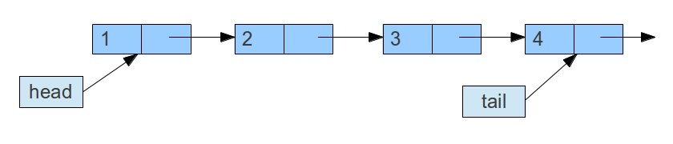

## 1 Introduction
The Queue is a interface in Java. There are a lot of implementations and I will introduce them. Queue is a FIFO model and there are 2 types of implementations: Array and LinkedList:
###### Array

###### LinkedList

Since it's a queue, the added element will be put at the tail of the queue and the removed element will be taken from the one that at the head position of the queue. The following picture will show you the relationship in JDK:

Here we can see that Deque is a interface too and it extends Queue. LinkedList and ArrayDeque implement Deque. In the Queue, here are some definitions:

	public interface Queue<E> extends Collection<E> {  
	  
	    boolean add(E e);  // add element into the tail of queue.
	    boolean offer(E e);  // add element into the tail of queue. It is useful when the capacity is limited.
	    E remove(); // get data at the head of queue and delete it 
	    E poll(); // get data at the head of queue and delete it. If queue is null then return null.   
	    E element(); // get data at the head of queue and do not delete it
	    E peek(); // get data at the head of queue and do not delete it. If queue is null then return null. 
	}  

Besides LinkedList and ArrayDeque, there is another implementation of Queue which is PriorityQueue. Here we will see all of them

## 2 PriorityQueue
The priority does not mean the order of input but the order of element. Here is a example:

	public class PriorityQueueTest {
	    public static void main(String[] args){
	        PriorityQueue pq = new PriorityQueue();
	        pq.offer(6);
	        pq.add(-3);
	        pq.add(20);
	        pq.offer(18);
	        //out put：[-3, 6, 20, 18]
	        System.out.println(pq);
	    }
	}

Since it will order the element, the null element will not be allowed to input into it.

## 3 Deque  
If we see what is in Deque in detail, we can see there are 4 parts:1. definition of double-ended queue; 2. definition of Queue; 3. difinition of Stack; 4. difinition of Collection. From the part 3 and 4 we can know that we can treat it as a collection. Here we see the difinition of Deque.
### 3.1 ArrayDeque
The ArrayDeque is based on array and use "head" and "tail" to point to the head and tail of queue. 
Somo of its difinition is like the following:

	private transient E[] elements;    
	private transient int head;  
	private transient int tail;  
	private static final int MIN_INITIAL_CAPACITY = 8;  

The default size is 8 and it is index of 2. That will be useful if we want to change the size.

##### Changing Size
There are 2 ways to set the size: (1)allocateElements; (2)doubleCapacity. The allocateElements is uesd for setting size when invoking constructor. The doubleCapacity is used when the capacity is not enough and increase it. 
Here is the source code:

	private void allocateElements(int numElements) {  
	    int initialCapacity = MIN_INITIAL_CAPACITY;  
	    // Find the best power of two to hold elements.  
	    // Tests "<=" because arrays aren't kept full.  
	    if (numElements >= initialCapacity) {  
	        initialCapacity = numElements;  
	        initialCapacity |= (initialCapacity >>>  1);  
	        initialCapacity |= (initialCapacity >>>  2);  
	        initialCapacity |= (initialCapacity >>>  4);  
	        initialCapacity |= (initialCapacity >>>  8);  
	        initialCapacity |= (initialCapacity >>> 16);  
	        initialCapacity++;  
	  
	        if (initialCapacity < 0)   // Too many elements, must back off  
	            initialCapacity >>>= 1;// Good luck allocating 2 ^ 30 elements  
	    }  
	    elements = (E[]) new Object[initialCapacity];  
	}  

	private void doubleCapacity() {  
	    assert head == tail;  
	    int p = head;  
	    int n = elements.length;  
	    int r = n - p; // number of elements to the right of p  
	    int newCapacity = n << 1;  
	    if (newCapacity < 0)  
	        throw new IllegalStateException("Sorry, deque too big");  
	    Object[] a = new Object[newCapacity];  
	    System.arraycopy(elements, p, a, 0, r);  
	    System.arraycopy(elements, 0, a, r, p);  
	    elements = (E[])a;  
	    head = 0;  
	    tail = n;  
	} 

##### Add Element
There are 2 ways of adding element:(1)add; (2)offer.

	public boolean add(E e) {  
	    addLast(e);  
	    return true;  
	}  
	  
	public void addLast(E e) {  
	    if (e == null)  
	        throw new NullPointerException();  
	    elements[tail] = e;  
	    if ( (tail = (tail + 1) & (elements.length - 1)) == head)  
	        doubleCapacity();  
	}  
	  
	public boolean offer(E e) {  
	    return offerLast(e);  
	}  
	  
	public boolean offerLast(E e) {  
	    addLast(e);  
	    return true;  
	}  

Apparently, the implementation of them is almost the same.

##### Get element
There are some ways showed in the following:

	public E element() {  
	    return getFirst();  
	}  
	  
	public E getFirst() {  
	    E x = elements[head];  
	    if (x == null)  
	        throw new NoSuchElementException();  
	    return x;  
	}  
	  
	public E peek() {  
	    return peekFirst();  
	}  
	  
	public E peekFirst() {  
	    return elements[head]; // elements[head] is null if deque empty  
	}  
	  
	public E getLast() {  
	    E x = elements[(tail - 1) & (elements.length - 1)];  
	    if (x == null)  
	        throw new NoSuchElementException();  
	    return x;  
	}  
	  
	public E peekLast() {  
	    return elements[(tail - 1) & (elements.length - 1)];  
	}  

### 3.1 LinkedList
I have introduced LinkedList, you can see it in [here](https://kincolle.github.io/2018/03/13/Collection-LinkedList/).