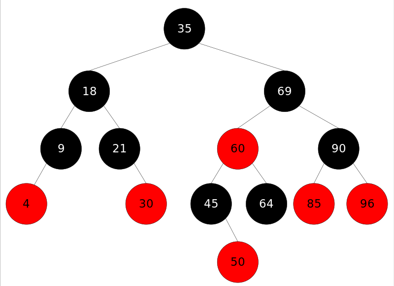
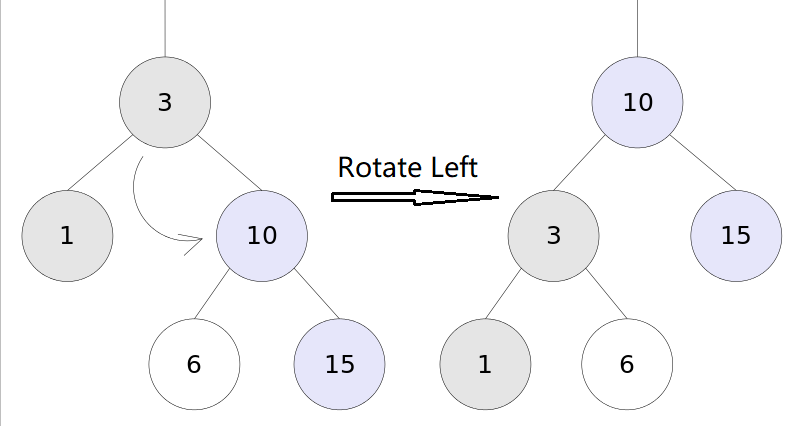
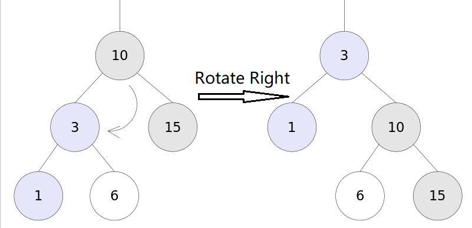
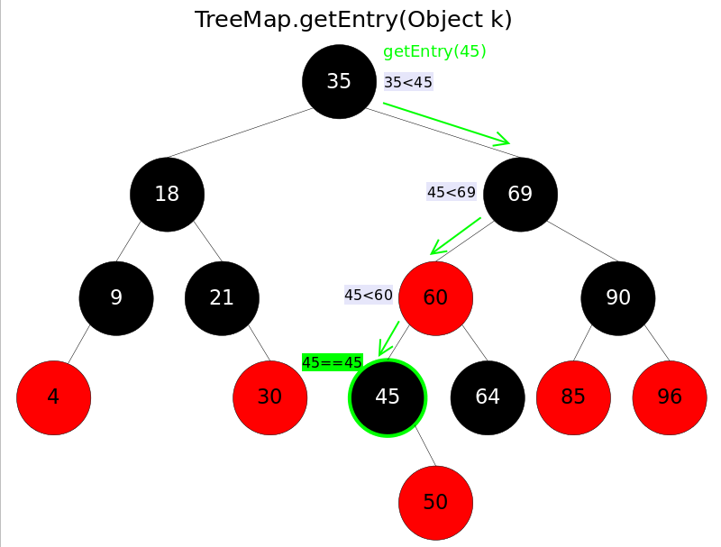
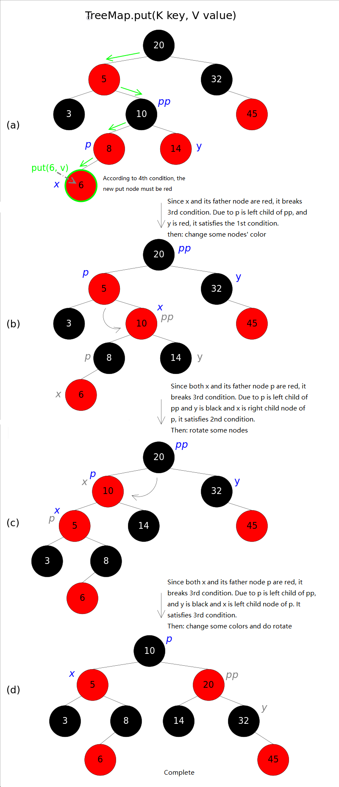
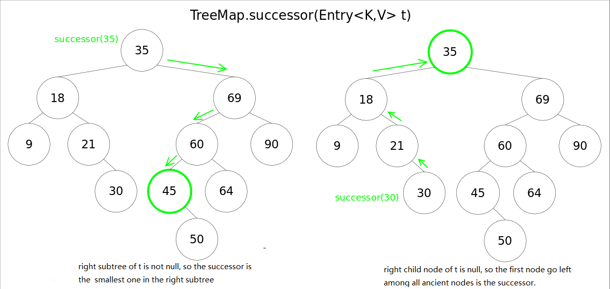
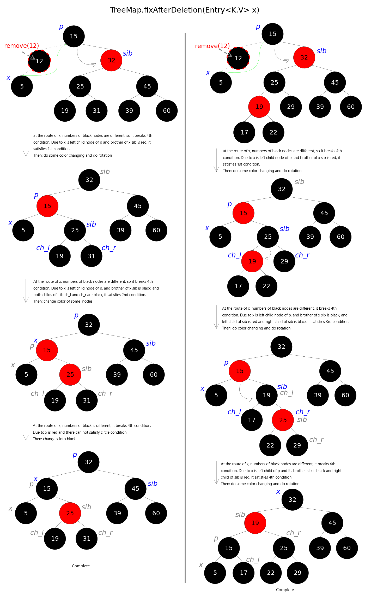

# Red Black Tree and TreeMap and TreeSet
## 1 Introduction of Red Black Tree
Java TreeMap implements SortedMap interface, that is to say it can sort elements according to key. You can use natural ordering or override a Comparator. 
TreeMap is using Red-Black tree, which means the runtime of containsKey(), get(), put() and remove() are log(n).   

By the way, TreeMap is not thread safe.  
The Red-Black tree is near to the Binary Search Tree, and it will make sure in any subtree, high of any two nodes will less than two times. In detail, there are some conditions should be satisfied:

* There are only two kinds of node, red and black.
* Root node must be black node.
* Red node can not be continued.(Which means neither father node or child node of a red node should not be a red node)
* From every node to ant of its null node, the number of black node is the same.

When the structure of the tree has been changed(like inserting of deleting), the 3rd or 4th contition will be destroyed, so it need be reconstructed to satisfy all the conditions. 

## 2 Some Knowledge of Red Black Tree
##### Rotate Left
Rotating left means let right tree of x be father of x. When finish, the conditions of Red Black Tree are still satisfied. 

Here is the source code of rotating left of TreeMap:

	//Rotate Left
	private void rotateLeft(Entry<K,V> p) {
	    if (p != null) {
	        Entry<K,V> r = p.right;
	        p.right = r.left;
	        if (r.left != null)
	            r.left.parent = p;
	        r.parent = p.parent;
	        if (p.parent == null)
	            root = r;
	        else if (p.parent.left == p)
	            p.parent.left = r;
	        else
	            p.parent.right = r;
	        r.left = p;
	        p.parent = r;
	    }
	}

##### Rotate Right
Rotating right means let left tree of x be father of x. When finish, the conditions of Red Black Tree are still satisfied. 

Here is the source code of rotating right of TreeMap:

	//Rotate Right
	private void rotateRight(Entry<K,V> p) {
	    if (p != null) {
	        Entry<K,V> l = p.left;
	        p.left = l.right;
	        if (l.right != null) l.right.parent = p;
	        l.parent = p.parent;
	        if (p.parent == null)
	            root = l;
	        else if (p.parent.right == p)
	            p.parent.right = l;
	        else p.parent.left = l;
	        l.right = p;
	        p.parent = l;
	    }
	}

## Functions of Red Black Tree
##### get()
get(Object key) function gets value according to key. This function invokes getEntry(Object key) to get the right entry, and then return "entry.value". getEntry() is the core of the algorithm. In the algorithm, search elements accoring to order of key, until we find one entry that satisfies "k.compareTo(p.key) == 0".  

The source code is

	//getEntry() function
	final Entry<K,V> getEntry(Object key) {
	    ......
	    if (key == null)//do not allow null key
	        throw new NullPointerException();
	    Comparable<? super K> k = (Comparable<? super K>) key;//order elements
	    Entry<K,V> p = root;
	    while (p != null) {
	        int cmp = k.compareTo(p.key);
	        if (cmp < 0)//go left
	            p = p.left;
	        else if (cmp > 0)//go right
	            p = p.right;
	        else
	            return p;
	    }
	    return null;
	}

##### put()
put(K key, V value) function will put the key-value into a TreeMap. This function will do search for once, if the map has contained the key then replace the value, if not then insert it. Since the inserting may break the structure, so the reconstruction may start. 
Here is the source code:

	public V put(K key, V value) {
	    ......
	    int cmp;
	    Entry<K,V> parent;
	    if (key == null)
	        throw new NullPointerException();
	    Comparable<? super K> k = (Comparable<? super K>) key;//order elements
	    do {
	        parent = t;
	        cmp = k.compareTo(t.key);
	        if (cmp < 0) t = t.left;//go left
	        else if (cmp > 0) t = t.right;//go right
	        else return t.setValue(value);
	    } while (t != null);
	    Entry<K,V> e = new Entry<>(key, value, parent);//create a new entry and insert it
	    if (cmp < 0) parent.left = e;
	    else parent.right = e;
	    fixAfterInsertion(e);//do rotate
	    size++;
	    return null;
	}

There codes are used to put data and it's easy to understand: First, find the right location to put data. The hard point is "fixAfterInsertion()", as said before that the reconstruction may start.

fixAfterInsertion() is showed in the following.

	//fixAfterInsertion()
	private void fixAfterInsertion(Entry<K,V> x) {
	    x.color = RED;
	    while (x != null && x != root && x.parent.color == RED) {
	        if (parentOf(x) == leftOf(parentOf(parentOf(x)))) {
	            Entry<K,V> y = rightOf(parentOf(parentOf(x)));
	            if (colorOf(y) == RED) {//ify is null, treat it as black
	                setColor(parentOf(x), BLACK);              // situation1
	                setColor(y, BLACK);                        // situation1
	                setColor(parentOf(parentOf(x)), RED);      // situation1
	                x = parentOf(parentOf(x));                 // situation1
	            } else {
	                if (x == rightOf(parentOf(x))) {
	                    x = parentOf(x);                       // situation2
	                    rotateLeft(x);                         // situation2
	                }
	                setColor(parentOf(x), BLACK);              // situation3
	                setColor(parentOf(parentOf(x)), RED);      // situation3
	                rotateRight(parentOf(parentOf(x)));        // situation3
	            }
	        } else {
	            Entry<K,V> y = leftOf(parentOf(parentOf(x)));
	            if (colorOf(y) == RED) {
	                setColor(parentOf(x), BLACK);              // situation4
	                setColor(y, BLACK);                        // situation4
	                setColor(parentOf(parentOf(x)), RED);      // situation4
	                x = parentOf(parentOf(x));                 // situation4
	            } else {
	                if (x == leftOf(parentOf(x))) {
	                    x = parentOf(x);                       // situation5
	                    rotateRight(x);                        // situation5
	                }
	                setColor(parentOf(x), BLACK);              // situation6
	                setColor(parentOf(parentOf(x)), RED);      // situation6
	                rotateLeft(parentOf(parentOf(x)));         // situation6
	            }
	        }
	    }
	    root.color = BLACK;
	}

##### successor node
For a binary search tree, get a node t, you can get a successor node by using:

* right subtree of t is not null, the successor node of t is the smallest one in the right subtree.
* right subtree of t is null, then successor node of t is the first one which go left among the ancient nodes.

These will be used in the removing cuntion. Here is the source code:
	
	// successor() in TreeMap
	static <K,V> TreeMap.Entry<K,V> successor(Entry<K,V> t) {
	    if (t == null)
	        return null;
	    else if (t.right != null) {// 1. t的右子树不空，则t的后继是其右子树中最小的那个元素
	        Entry<K,V> p = t.right;
	        while (p.left != null)
	            p = p.left;
	        return p;
	    } else {// 2. t的右孩子为空，则t的后继是其第一个向左走的祖先
	        Entry<K,V> p = t.parent;
	        Entry<K,V> ch = t;
	        while (p != null && ch == p.right) {
	            ch = p;
	            p = p.parent;
	        }
	        return p;
	    }
	}

##### remove()
Function of remove(Object key) is deleting entry of one key. This function will gey entry by using "getEntry(Object key)", and the invoke "deleteEntry(Entry<K,V> entry)" to delete one entry. Since this operation may break structure of Red Black Tree, so rotation may happen.  
I have described "getEntry()", now the point is "deleteEntry()". There are two situations:

* delete node p and both its left tree and right tree are null or only one not null tree.
* delete node p and both its left tree and right tree are not null trees.

In situation 1, it's easy, just delete p and use not null tree if exists to replace it. In situation 2, you can use successor s of p to replace p then use rule of situation 1 to delete s.

Here is the source code:     

		// deleteEntry()
		private void deleteEntry(Entry<K,V> p) {
		    modCount++;
		    size--;
		    if (p.left != null && p.right != null) {// 2. both left tree and right tree of p are not null trees。
		        Entry<K,V> s = successor(p);// successor
		        p.key = s.key;
		        p.value = s.value;
		        p = s;
		    }
		    Entry<K,V> replacement = (p.left != null ? p.left : p.right);
		    if (replacement != null) {// 1. only one subtree is not null tree
		        replacement.parent = p.parent;
		        if (p.parent == null)
		            root = replacement;
		        else if (p == p.parent.left)
		            p.parent.left  = replacement;
		        else
		            p.parent.right = replacement;
		        p.left = p.right = p.parent = null;
		        if (p.color == BLACK)
		            fixAfterDeletion(replacement);// rotation
		    } else if (p.parent == null) {
		        root = null;
		    } else { // 1. both left tree and right tree of p are null
		        if (p.color == BLACK)
		            fixAfterDeletion(p);// rotation
		        if (p.parent != null) {
		            if (p == p.parent.left)
		                p.parent.left = null;
		            else if (p == p.parent.right)
		                p.parent.right = null;
		            p.parent = null;
		        }
		    }
		}

In the codes, it's not difficult to understand. Here I will describe about fixAfterDeletion().

In the picture above,:Situation1 turn into situation 2 firstly, or turn into situation 3 or 4. Of course, this picture does not means it must start from situation 1. From the source code we can find that: (1) if it is from 1 to 2, then situation 2 must quit the circle because x is red (2) when come into 3 or 4, it must quit the circle. 
Here is the source code:

	private void fixAfterDeletion(Entry<K,V> x) {
	    while (x != root && colorOf(x) == BLACK) {
	        if (x == leftOf(parentOf(x))) {
	            Entry<K,V> sib = rightOf(parentOf(x));
	            if (colorOf(sib) == RED) {
	                setColor(sib, BLACK);                   // situation1
	                setColor(parentOf(x), RED);             // situation1
	                rotateLeft(parentOf(x));                // situation1
	                sib = rightOf(parentOf(x));             // situation1
	            }
	            if (colorOf(leftOf(sib))  == BLACK &&
	                colorOf(rightOf(sib)) == BLACK) {
	                setColor(sib, RED);                     // situation2
	                x = parentOf(x);                        // situation2
	            } else {
	                if (colorOf(rightOf(sib)) == BLACK) {
	                    setColor(leftOf(sib), BLACK);       // situation3
	                    setColor(sib, RED);                 // situation3
	                    rotateRight(sib);                   // situation3
	                    sib = rightOf(parentOf(x));         // situation3
	                }
	                setColor(sib, colorOf(parentOf(x)));    // situation4
	                setColor(parentOf(x), BLACK);           // situation4
	                setColor(rightOf(sib), BLACK);          // situation4
	                rotateLeft(parentOf(x));                // situation4
	                x = root;                               // situation4
	            }
	        } else { 
	            Entry<K,V> sib = leftOf(parentOf(x));
	            if (colorOf(sib) == RED) {
	                setColor(sib, BLACK);                   // situation5
	                setColor(parentOf(x), RED);             // situation5
	                rotateRight(parentOf(x));               // situation5
	                sib = leftOf(parentOf(x));              // situation5
	            }
	            if (colorOf(rightOf(sib)) == BLACK &&
	                colorOf(leftOf(sib)) == BLACK) {
	                setColor(sib, RED);                     // situation6
	                x = parentOf(x);                        // situation6
	            } else {
	                if (colorOf(leftOf(sib)) == BLACK) {
	                    setColor(rightOf(sib), BLACK);      // situation7
	                    setColor(sib, RED);                 // situation7
	                    rotateLeft(sib);                    // situation7
	                    sib = leftOf(parentOf(x));          // situation7
	                }
	                setColor(sib, colorOf(parentOf(x)));    // situation8
	                setColor(parentOf(x), BLACK);           // situation8
	                setColor(leftOf(sib), BLACK);           // situation8
	                rotateRight(parentOf(x));               // situation8
	                x = root;                               // situation8
	            }
	        }
	    }
	    setColor(x, BLACK);
	}

## TreeSet
TreeSet is based on TreeMap, so if you understand TreeMap, you already understand TreeSet:

	public class TreeSet<E> extends AbstractSet<E>
	    implements NavigableSet<E>, Cloneable, java.io.Serializable
	{
	    ......
	    private transient NavigableMap<E,Object> m;
	    // Dummy value to associate with an Object in the backing Map
	    private static final Object PRESENT = new Object();
	    public TreeSet() {
	        this.m = new TreeMap<E,Object>();// TreeSet里面有一个TreeMap
	    }
	    ......
	    public boolean add(E e) {
	        return m.put(e, PRESENT)==null;
	    }
	    ......
	}