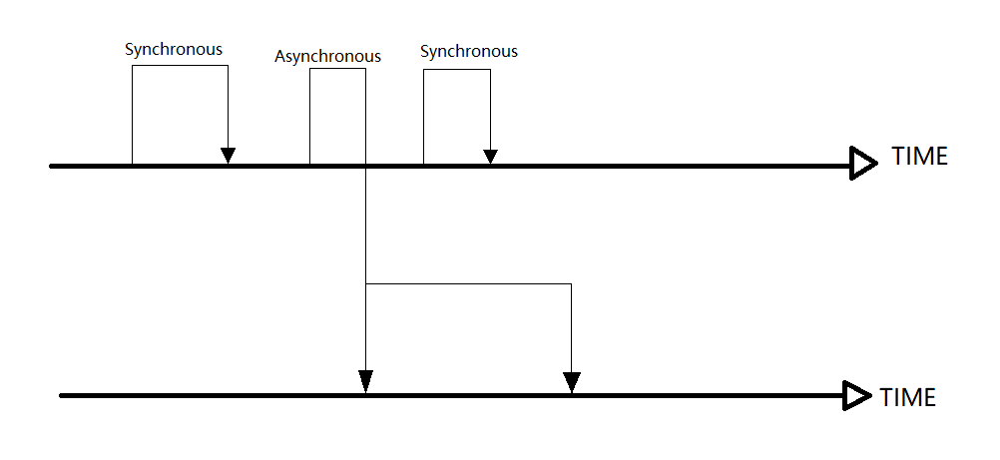

## 1.1 Synchronous and Asynchronous
we use Synchronous and Asynchronous to describe one invocation. About Synchronous, once it stars, the latter operation can start only the Synchronous has done. On the other hand, once Asynchronous stars, other operation can be done by other thread. The following pictire will show you the difference.

for example, when you want to buy a refrigerator, you can buy one at Amazon and let the seller send one to your home. before you can receive your refrigerator, you can do other things, that is asynchronous.

## 1.2 Concurrency and Parallel
There is always misunderstanding about concurrency and parallel. what I think is that: (1) Concurrency means more than one task are doing at segment; (2) Parallel means more than one task are doing at the same time. The following picture will show you about it.

## 1.3 critical section
The critical section means a section that has shared data which can be accessed by more than one thread. If one thread is using it, then others must wait until the thread has release the section, or,it some problems may happen. for example, when you have two picture want print, the printer must print one first and then another one. if not, the picture must be destroyed.

## 1.4 blocking and non-blocking
Blocking and non-blocking are used to describe the effect of different threads. for example, if one thread has get a critical section, the other threads which want to use this critical section must wait. On the other hand, non-blocking means one thread can't effect other threads.

## 1.5 Deadlock, Starvation and Livelock
Deadlock is a situation that each thread had hold some critical sections and wait others critical sections to operate. That means no thread can  start to operate and this situation will go on. The following picture will show you this situation.

Starvation is a situation that for some reason one thread can not get resources that it needs so it will never start.

Livelock is situation that all threads want to release resources so that others can start, then all threads can not start to operate.

## 1.6 Concurrency Level
Because of critical section, multi-thread concurrency must be controlled. We can get some concurrency level like:blocking, Starvation-Free, Obstruction-Free, Lock-Free and Wait-Free

### 1.6.1 Blocking
A thread is blocking means before other threads release resource, the thread will not operate. When we use synchronized, or ReenTrantLock, the thread will be blocking.
No matter synchronized or ReenTrantLock, it will try to get a lock of critical section before it starts to operate. If it fails to get a lock, it will hang on until get all the resources it needs.

### 1.6.2 Starvation-Free
It threads have priority, then it will prefer a thread with high priority to star first. That is to say, for obtaining one resource, it's unfair. For unfair lock, system always allow threads with high priority go ahead. That will lead threads with low priority may never operate. This is called Starvation-Free.

### 1.6.3 Obstruction-Free
Obstruction-Free is a kind of blocking invocation. They will not be hang on because of critical section. Will more than two threads rewrite data of critical section, if data became dirty, it will call back to make sure the pure data.

### 1.6.4 Lock-Free
At Lock-Free situation, all threads can access critical section and it can make sure one thread will operate sucessfully in finite steps.

### 1.6.5 Wait-Free
Wait-Free can let all threads will operate successfully in finite steps. In this way, Starvation-Free will never happen.

