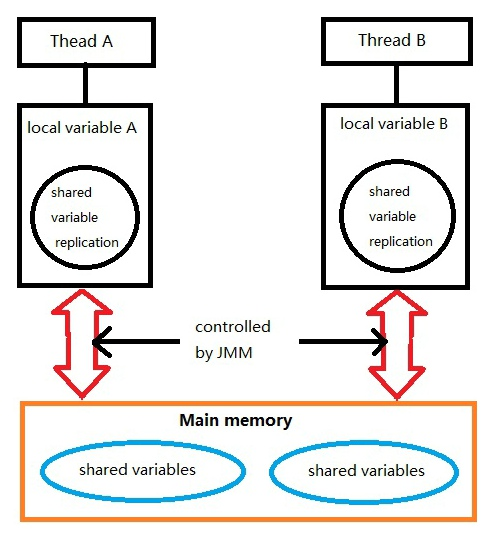
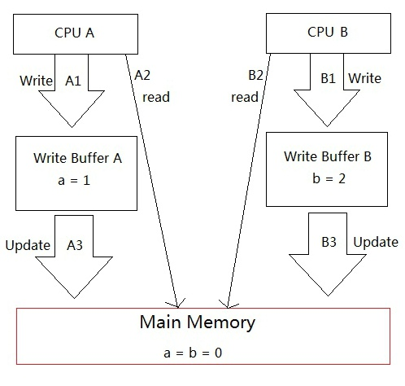

# JMM
## 1 Abstraction of Java Memory Model
In java, all the instance area, static area and array are stored in stack memory, and the stack memory are shared among threads. Local variables, formal method parameters and exception handler parameters will no be shared among threads, so there will be no visibility problem and will not be affected by JMM.
Communication of threads is controlled by JMM, JMM can make a decision that which thread can write data into shared variables that are visible to others.It can be said that JMM define the relationship between thread and main memory: shared variables of threads are stored in main memory, every thread can have a local memory, and in local memory the replication are stored for write/read by this thread. JMM is an abstract conception and it does not really exist. It contains buffer, register and other hardwares. The JMM is showed as the following picture.

    
according to the picture, if thread A and thread B want to communicate with each other, 2 steps must be done: 
1.first, thread A make the shared variables which are updated and stored in local memory of A into main memory. 
2.second, thread B get the shared data which has updated by thread a.
 

The following picture will show you the detail steps: 

As the picture shows, local memory A and B have replication of the share variable x.Persuming that at the first time in all three memoris the value of x is 0. Thread A update x into 1 and the value will be stored at local variable of A. when A and B want communicate, A when update main memory by using local variable of A, then in main memory the x is 1. Thread B go into main memory to get value of x which is 1 and update local variable of B, at this time the value of local variable of B is 1. 
We can see that A send message to B by using main memory. JMM control communication of main memory and every thread. to make sure the visibility of memory. 

## 2 Reordering
For higher performance of executing program, compiler and CPU always reorder the code. There are three types of reordering: 
1.compiler optimization reorder: Without change meaning of code, or instruction of single thread, compiler will changer order of execution. 
2.instruction paralell reorder: Modern CPU use Instruction-Level Parallelism to execute instructions. If there is no dependency, CPU can change order of instructions of execution. 
3.memory system reorder: Due to using of buffer of CPU, this make loading and storing execution seems execution at a random order. 
From java source to instruction of final execution, tree ordering has been done: reorder

In the picture, No.1 is compiler optimization reorder, No.2 and No.3 is CPU reordering. These reordering may have problems when concurrency happen in memory. JMM is memory model with language level, at different platform, by forbiding some reordering it can make sure of visibility of memory.

## 4 CPU Reordering and Memory Barrier
Modern CPU use buffer to temporarily store data which will be store in main memory. Every buffer is just visible to its CPU。 That will affect the order of instructions to the memory: 

| Processor A | Processor B |
|--|--|
| a = 1;//A1 x = b;//A2 | b = 2;//A1 y = a;//A2 |
| initial status: a=b=0  executed result: x=y=0 |:|

Persuming CPU A and CPU B access memory in the code order, but the final result is x=y=0. The detail reason is showed in the following picture.

Here both CPU A and CPU B can write shared variable into their buffer ( A1 And A2 ), then from the buffer to ( A2 and B2) , finally copy the data which is already writen in buffer to main memory ( A3 and B3). When execute in this order, the result is x=y=0. 
For main memory, only when CPU A finish executing A3 the A1 is real finished. So the code is A1 -> A2, but the real executing order is A2 -> A1. 
The key point is that buffer is only visible to its CPU, this may lead some problems. Because modern CPU using buffer, reordering offen happens. 
To make sure the visibility, java compiler will insert some memory barriers into instructions to forbid some reordering. There are four types of memory barriers showed at the following table:

| type | content | description |
| ------- | ------- | -------- | 
| LoadLoad Barriers | Load1; LoadLoad; Load2 | Make sure Load 1 must be before Load 2 and other following loadings |
| StoreStore Barriers | Store1; StoreStore; Store2 | Make sure Store 1 must be visible to other CPU and before Store 2 and other following Storing | 
| LoadStore Barriers | Load1; LoadStore; Store2 | Make sure Load 1 must be bofore Store 2 and other following instructions | 
| StoreLoad Barriers | Store1; StoreLoad; Load2 | Make sure all the memory instructions finished before instructions after Barriers |

## 5 Happens-Before Rule
I have already explained what is reordering, although java will do reordering, there are some rules needs to follow. The following will show you the rules:

* in one thread the instructions must be serial
* volatile variable must be writen before read to make sure the visibility
* unlock must before lock
* A->B, B->C, then A->C 
* start() is the first execution for all threads
* execution of all threads before Thread.join()
* interrupt() of one thread must before the code of the interrupted thread
* construction of one object must before finalize()

For example, reordering must not change the meaning of serial meaning of codes, like

	a=1;
	b=a+1;

Because the second code is depending on first code, so if change the order of the two codes the result of execution will be changed.

## 6 Data dependency

If there are 2 execution and more one is writing, then the 2 execution has dependency. There are 3 types of denpendecny:

| Name | example | description | 
| ------ | ------- | ------- |
| write then read | a=1; b=a; | write one variable then read it | 
| write then write | a=1; a=2; | write one variable then write it again | 
| read then write | a=b; b=1; | read one variable then write it |
   

When compiler do reordering, there rules must be followed.
