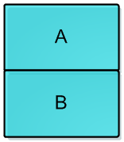
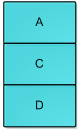
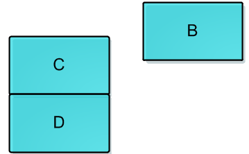

## 1 Introduction of Pessimistic Lock and Optimistic Lock
First of all, I want to introduce Pessimistic Lock and Optimistic Lock:

- Pessimistic Lock: It assumes the worst situation that every time the data get will be changed by other threads, so when you want to get data it must be locked on. In java the Synchronized is a Pessimistic Lock.
- Optimistic Lock: It assumes that every time the data get will not be changed by other threads. When update a data and the data is changed by others, then do not update the data and redo the operation again until the data is not changed by others.   

## 2 CAS
Before JDK1.5, only synchronized can be used for concurrence. Since it is a Exclusive Lock, so it is a Pessimistic Lock. There are some problems of Pessimistic Lock:

- At multi-threads situation, frequently locking and unlocking will spend much time.
- A thread with lock will let others be blocked.

For solving this problems, Optimistic Lock is a best way. By the way, Optimistic Lock is an idea, and CAS is its implementation. So, let me introduce the CAS. 

##### CAS
CAS is short for Compare and Swap. When more than one threads want to update a data at the same time and only one can update it successfully, then others will not be blocked but failed competition at this time and will try again. 
There are 3 parameters: (1) position of data:V; (2) Expected original value:A; (3) data to be updated:B. If value of data at the position of V equals to Expected original value, the CPU will update the data to B. If not, CPU will do nothing.  

##### CAS in Java
After JDK1.5, the java.util.concurrent (J.U.C) is based on CAS. Here we see AtomicInteger of J.U.C, it is liking doing ++i:

	public class AtomicInteger extends Number implements java.io.Serializable {  
	    private volatile int value; 
	
	    public final int get() {  
	        return value;  
	    }  
	
	    public final int getAndIncrement() {  
	        for (;;) {  
	            int current = get();  
	            int next = current + 1;  
	            if (compareAndSet(current, next))  
	                return current;  
	        }  
	    }  
	
	    public final boolean compareAndSet(int expect, int update) {  
	        return unsafe.compareAndSwapInt(this, valueOffset, expect, update);  
	    }  
	}

　
Without any lock, the value needs volatile to assure visibility of all threads. Then let's see how does ++i work. The getAndIncrement uses CAS, every time get data and plus one then compare is to do CAS. If succeed then return the result. The compareAndSet uses JNI(Java Native Interface) to execute CPU instructions: 　　

	public final boolean compareAndSet(int expect, int update) {   
	    return unsafe.compareAndSwapInt(this, valueOffset, expect, update);
	}

In "unsafe.compareAndSwapInt(this, valueOffset, expect, update);", it is liking the following:

	if (this == expect) {
	    this = update
	    return true;
	} else {
	    return false;
	}

So, how to make "this == expect" and "this = update" to be atomic? It is implemented by using CPU instructions. Hee is the source code of compareAndSwapInt():

	public final native boolean compareAndSwapInt(Object o, long offset,
                                              int expected,
                                              int x);

This is a local function, the C++ code is:
	
	#define LOCK_IF_MP(mp) __asm cmp mp, 0  \
	                       __asm je L0      \
	                       __asm _emit 0xF0 \
	                       __asm L0:
	
	inline jint     Atomic::cmpxchg    (jint     exchange_value, volatile jint*     dest, jint     compare_value) {
	  // alternative for InterlockedCompareExchange
	  int mp = os::is_MP();
	  __asm {
	    mov edx, dest
	    mov ecx, exchange_value
	    mov eax, compare_value
	    LOCK_IF_MP(mp)
	    cmpxchg dword ptr [edx], ecx
	  }
	}

As the code says, it will decide whether lock on cmpxchg instruction by judging current CPU.

## Problems In CAS
##### ABA Problem
If thread one get data A from position V, then another thread two get A and update it to B and update it again back to A, at this time for thread one when doing CAS it finds value of the data is still A, so the CAS operation of thread A will be success. This may leads problems like:

Now there is a single linked list stack, and at the top is A, thread T1 knows A.next is B and try to use CAS to replace the top with B:
	
	head.compareAndSet(A,B);

Before T1 do this instruction, thread T2 comes in and pops A and B then pushs D, C and A. At this the the situation is showed in the following picture and the B is not in the stack:

Now T1 do its CAS it finds A is still at the top of the stack so the CAS secceeds and the top will be replaced with B. But B.next is null. So the situation is: 

At the stack only B is in it and C and D is missing. 
From JDK1.5, atomic package provides AtomicStampedReference to solve the ABA problem. It checks the expected origin value and check a expected flag:

	public boolean compareAndSet(
               V      expectedReference,
               V      newReference,
              int    expectedStamp,
              int    newStamp //更新后的标志
	)