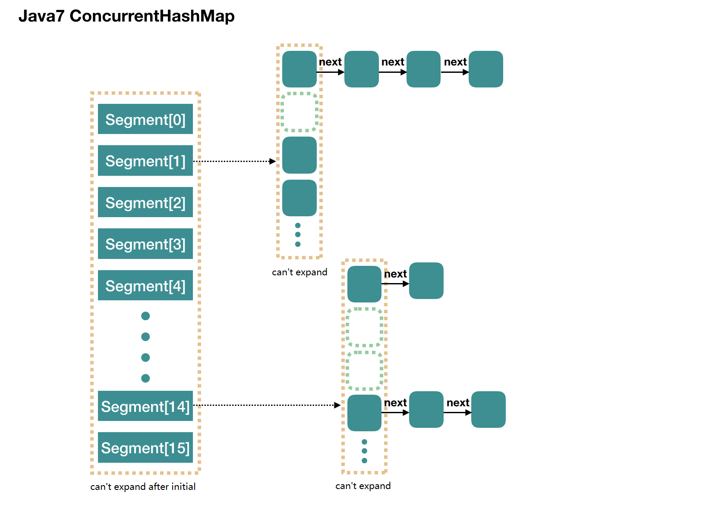

## 1. Introduction Of Concurrent HashMap In JDK 1.7
ConcurrentHashMap is almost like HashMap and it supports concurrent operations, so it is more complex. A whole ConcurrentHashMap is comprised of Segments, that means ConcurrentHashMap is a Segment array and it extends ReentrantLock to do lock. So if every Segment is thread safe, then the whole ConcurrentHashMap is thread safe. 

**concurrencyLevel**：The default value is 16. Which means in ConcurrentHashMap there are 16 Segments. theoretically, it can support at most 16 threads works at the same time if different thread works on different Segment. This value can be set when initial, but can not be expanded after initial. 
In Segment, it is like HashMap but it will support thread safe.

## 2. Initial
initialCapacity: initial volume, it is initial value of a whole ConcurrentHashMap and will be divided qually into each Segment.   
loadFactor: I hava said that Segment can not be expanded after initial, so it is used in every inner Segment.

	public ConcurrentHashMap(int initialCapacity,
	                         float loadFactor, int concurrencyLevel) {
	    if (!(loadFactor > 0) || initialCapacity < 0 || concurrencyLevel <= 0)
	        throw new IllegalArgumentException();
	    if (concurrencyLevel > MAX_SEGMENTS)
	        concurrencyLevel = MAX_SEGMENTS;
	    // Find power-of-two sizes best matching arguments
	    int sshift = 0;
	    int ssize = 1;
	    // the concurrencyLevel is ssize，and it needs to be kept as the nth power of 2
	    while (ssize < concurrencyLevel) {
	        ++sshift;
	        ssize <<= 1;
	    }
	    // In default，concurrencyLevel is 16，sshift is 4
	    // After computing, segmentShift is 28，segmentMask is 15
	    this.segmentShift = 32 - sshift;
	    this.segmentMask = ssize - 1;
	
	    if (initialCapacity > MAXIMUM_CAPACITY)
	        initialCapacity = MAXIMUM_CAPACITY;
	
	    // initialCapacity will set the size of the whole map when initial
	    // Computing size of every segment can get according to initialCapacity 
	    // if initialCapacity is 64，then every Segment will have size of 4
	    int c = initialCapacity / ssize;
	    if (c * ssize < initialCapacity)
	        ++c;
	    // default MIN_SEGMENT_TABLE_CAPACITY is, then it will not rehash when the first element comes and will do rehash when the second one comes 
	    int cap = MIN_SEGMENT_TABLE_CAPACITY; 
	    while (cap < c)
	        cap <<= 1;
	
	    // create Segment array
	    // and create the first element segment[0]
	    Segment<K,V> s0 =
	        new Segment<K,V>(loadFactor, (int)(cap * loadFactor),
	                         (HashEntry<K,V>[])new HashEntry[cap]);
	    Segment<K,V>[] ss = (Segment<K,V>[])new Segment[ssize];
	    // put the segment[0] into the array
	    UNSAFE.putOrderedObject(ss, SBASE, s0); // ordered write of segments[0]
	    this.segments = ss;
	}

When the finishing completed, we get a Segment array. We use "new ConcurrentHashMap()" to do it, after the finishing:
 
- length of Segment array is 16 and can not be changed.
- Default size of Segment[i] is 2 and loadFactor is 0.75, so we have 2*0.75=1.5. That is why it will not rehash when the first element comes and will do rehash when the second one comes 
- Here we inited segment[0], and others are null
-  segmentShift is 32 - 4 = 28, segmentMask is 16 - 1 = 15

## 3. Put
Here let's see how put works:

	public V put(K key, V value) {
	    Segment<K,V> s;
	    if (value == null)
	        throw new NullPointerException();
	    // 1. computing hash value of key
	    int hash = hash(key);
	    // 2. find position j in Segment array according to hash value
	    //    hash is 32 bit, move right segmentShift(28) bit, then left 4 bit,
	    
	    int j = (hash >>> segmentShift) & segmentMask;
	    // all are null except segment[0] after initial
	    // ensureSegment(j) 对 segment[j] 进行初始化
	    if ((s = (Segment<K,V>)UNSAFE.getObject          // nonvolatile; recheck
	         (segments, (j << SSHIFT) + SBASE)) == null) //  in ensureSegment
	        s = ensureSegment(j);
	    // 3. put new value into s
	    return s.put(key, hash, value, false);
	}

The first layout is simple. Just find the Segment according to hash value then do put operation in the Segment. 
In the Segment, it is comprised of array and linked likst.

	final V put(K key, int hash, V value, boolean onlyIfAbsent) {
	    // Before write into this segment, it needs lock firts
	    HashEntry<K,V> node = tryLock() ? null :
	        scanAndLockForPut(key, hash, value);
	    V oldValue;
	    try {
	        // this is a array in the segment
	        HashEntry<K,V>[] tab = table;
	        // use hash code to find the index in the array
	        int index = (tab.length - 1) & hash;
	        // first is the head of linked list
	        HashEntry<K,V> first = entryAt(tab, index);
	
	        for (HashEntry<K,V> e = first;;) {
	            if (e != null) {
	                K k;
	                if ((k = e.key) == key ||
	                    (e.hash == hash && key.equals(k))) {
	                    oldValue = e.value;
	                    if (!onlyIfAbsent) {
	                        // cover ole value
	                        e.value = value;
	                        ++modCount;
	                    }
	                    break;
	                }
	                // go on by the linked list
	                e = e.next;
	            }
	            else {
	                // if node is not null, then set it as the head of linked list; if it is null, do initial and set it as the head of linked list
	                if (node != null)
	                    node.setNext(first);
	                else
	                    node = new HashEntry<K,V>(hash, key, value, first);
	
	                int c = count + 1;
	                // if it is over the threshold, then do rehash
	                if (c > threshold && tab.length < MAXIMUM_CAPACITY)
	                    rehash(node); 
	                else
	                    // if it is not over the threshold, then put node at the position of index in the tab array
	                    setEntryAt(tab, index, node);
	                ++modCount;
	                count = c;
	                oldValue = null;
	                break;
	            }
	        }
	    } finally {
	        // do unlock
	        unlock();
	    }
	    return oldValue;
	}

Because of lock, it is thread safe.

## 4. ensureSegment
When ConcurrentHashMap do initial, it will create a segment[0]. For other segments, it will do initial when new elements come.

Here we need to think about concurrency, that may more than one threads to initial the same segment[k]. Only one can success. 

	private Segment<K,V> ensureSegment(int k) {
	    final Segment<K,V>[] ss = this.segments;
	    long u = (k << SSHIFT) + SBASE; // raw offset
	    Segment<K,V> seg;
	    if ((seg = (Segment<K,V>)UNSAFE.getObjectVolatile(ss, u)) == null) {
	        
	        Segment<K,V> proto = ss[0];
	        int cap = proto.table.length;
	        float lf = proto.loadFactor;
	        int threshold = (int)(cap * lf);
	
	        // initial the array in the segment[k]
	        HashEntry<K,V>[] tab = (HashEntry<K,V>[])new HashEntry[cap];
	        if ((seg = (Segment<K,V>)UNSAFE.getObjectVolatile(ss, u))
	            == null) { // check again that whether it is inited by other threads

	            Segment<K,V> s = new Segment<K,V>(lf, threshold, tab);
	            // Use while loopm and CAS, to make sure the current thread will success, then quit
	            while ((seg = (Segment<K,V>)UNSAFE.getObjectVolatile(ss, u))
	                   == null) {
	                if (UNSAFE.compareAndSwapObject(ss, u, null, seg = s))
	                    break;
	            }
	        }
	    }
	    return seg;
	}

We can see that ensureSegment(int k) use CAS to control concurrency problems.

## 5. scanAndLockForPut
When we want to put element into one segment, it will invoke "node = tryLock() ? null : scanAndLockForPut(key, hash, value)", that is to say it will do tryLock() to get lock of the current segment. If fail then go into scanAndLockForPut to get lock:    

	private HashEntry<K,V> scanAndLockForPut(K key, int hash, V value) {
	    HashEntry<K,V> first = entryForHash(this, hash);
	    HashEntry<K,V> e = first;
	    HashEntry<K,V> node = null;
	    int retries = -1; // negative while locating node
	
	    // Get lock in the loop
	    while (!tryLock()) {
	        HashEntry<K,V> f; // to recheck first below
	        if (retries < 0) {
	            if (e == null) {
	                if (node == null) // speculatively create node
	                    
	                    node = new HashEntry<K,V>(hash, key, value, null);
	                retries = 0;
	            }
	            else if (key.equals(e.key))
	                retries = 0;
	            else
	                // go on with the linked list
	                e = e.next;
	        }
	
	        else if (++retries > MAX_SCAN_RETRIES) {
	            lock();
	            break;
	        }
	        else if ((retries & 1) == 0 &&
	                
	                 (f = entryForHash(this, hash)) != first) {
	            e = first = f; // re-traverse if entry changed
	            retries = -1;
	        }
	    }
	    return node;
	}

There a 2 exits: one is tryLock() suceeds and quit the loop; another is over MAX_SCAN_RETRIES then do lock() and it will block the thread until get lock.

## 6. Get
Get is easy:

1. compute hash code and find the index in Segment array
2. fing position in the array in the segment
3. find entry in the linked list

	public V get(Object key) {
	    Segment<K,V> s; // manually integrate access methods to reduce overhead
	    HashEntry<K,V>[] tab;
	    // 1. hash value
	    int h = hash(key);
	    long u = (((h >>> segmentShift) & segmentMask) << SSHIFT) + SBASE;
	    // 2. get segment according to hash value
	    if ((s = (Segment<K,V>)UNSAFE.getObjectVolatile(segments, u)) != null &&
	        (tab = s.table) != null) {
	        
	        for (HashEntry<K,V> e = (HashEntry<K,V>) UNSAFE.getObjectVolatile
	                 (tab, ((long)(((tab.length - 1) & h)) << TSHIFT) + TBASE);
	             e != null; e = e.next) {
	            K k;
	            if ((k = e.key) == key || (e.hash == h && key.equals(k)))
	                return e.value;
	        }
	    }
	    return null;
	}

