## 1. Introduction
There are 2 kinds of concurrency queue: one is using lock and another one is using CAS. Using CAS means it does not block. Here let's see how ConcurrentLinkedQueue works by using CAS. 
 
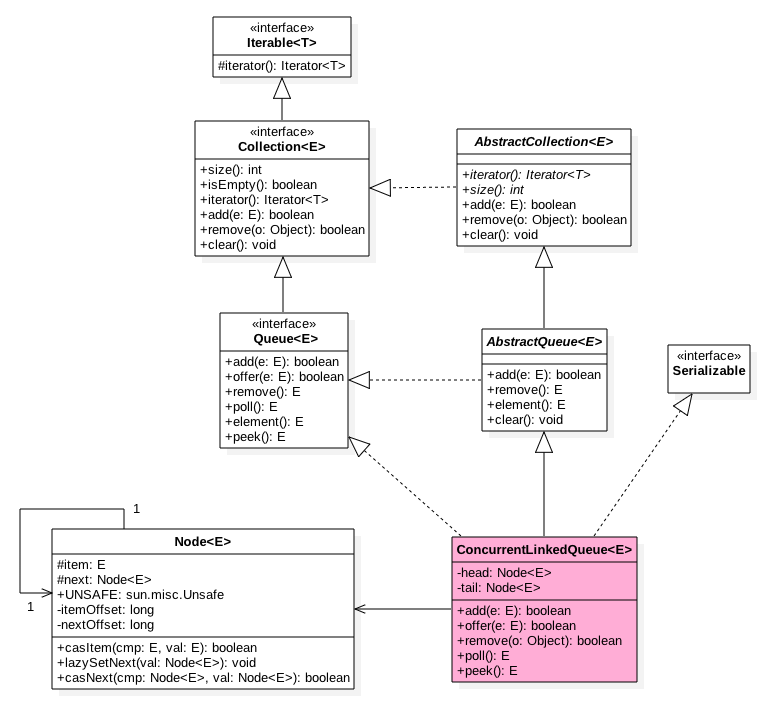

There are 2 volatile node to store head node and tail node. In the head node, it stores the first node that its item is null. In the tail node, its next does not always point to the last node. In the node, item stores value and next points to the next one, so the linked list has only one direction.

	public ConcurrentLinkedQueue() {
	    head = tail = new Node<E>(null);
	}

From the code we can see that when we construct a ConcurrentLinkedQueue there is a node with null item.

## 2. Offer
The offer operation will put one element into the tail of queue, here let's see the code:

	public boolean offer(E e) {
	    //throw null if e is null
	    checkNotNull(e);
	 
	    final Node<E> newNode = new Node<E>(e);
	 
	 
	    //insert into tail
	    for (Node<E> t = tail, p = t;;) {
	 
	        Node<E> q = p.next;
	 
	        //if q=null, it means p is the tail node
	        if (q == null) {
	 
	            //cas put(1)
	            if (p.casNext(null, newNode)) {
	                if (p != t) // hop two nodes at a time
	                    casTail(t, newNode);  // Failure is OK.
	                return true;
	            }
	            // Lost CAS race to another thread; re-read next
	        }
	        else if (p == q)//(2)
	            p = (t != (t = tail)) ? t : head;
	        else
	            // find the last one node(3)
	            p = (p != t && t != (t = tail)) ? t : q;
	    }
	}

From the constructors we know that there will be a node with item null when init, and head node and tail node will point to it. When a thread invoke offer:

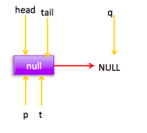

As the picture says, it will search the tail node, and q==null so p is the one. Do p.casNext to set next of p as the new node. At this time p==t, so do not set the current node as tail node. Since multi threads can invoke offer function, so if 2 threads do it can do (1)cas, only one can suceed. Persuming thread 1 succeed, then the list will be:

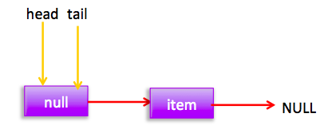

The failed thread will do the loop for once and the pointer will be:

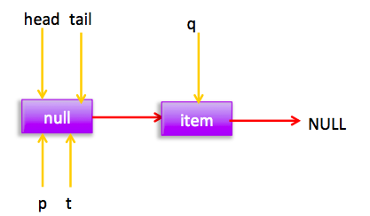

At this time it will do (3), so p=q, then the pointer will be:

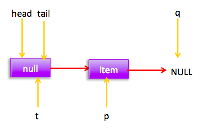

Thread 2 cas succeed and undate tail node, at this time the list and pointer will be:

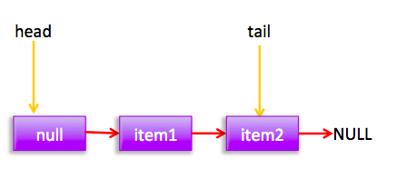

Persuming when thread 2 is doing CAS, thread 3 do it too. And thread 3 failed once and do a loop for once. In thread 3 the pointer will be:

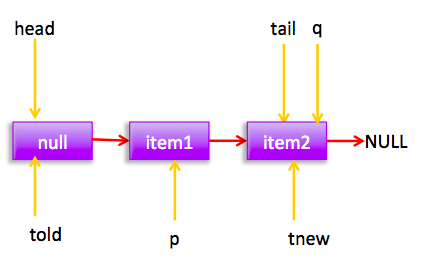

At this time p!=t and origin value of t is told and its new value is tnew, so told!=tnew and p=tnew=tail;. Do a loop and will be: 

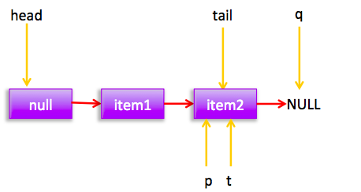

Since q==null so do (1).   
You may wonder how can we go into p==q situation. When you poll, this may happen. After poll, the situation will be like:

At this time when put elements, the pointer will be:

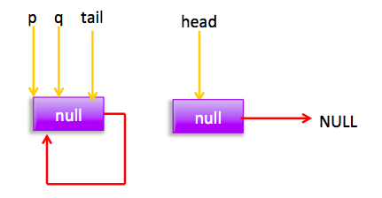

It will do (2) and p=head, after the loop the pointer will be:

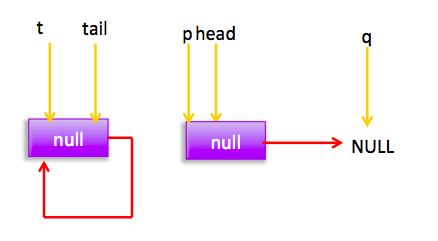

So do (1), then p!=t. So set tail node and will be like:

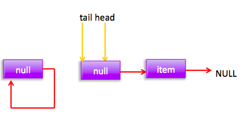

The one point to itself will be GCed. 

## 3. add
The add operation will put one element at the tail of the list. In fact it uese offer: 

	public boolean add(E e) {
	    return offer(e);
	}

## 4. poll
The poll operation will get the element at the first place and remove it:

	public E poll() {
	    restartFromHead:
	 
	    //dead loop
	    for (;;) {
	 
	        //dead loop
	        for (Node<E> h = head, p = h, q;;) {
	 
	            //save value of the current node
	            E item = p.item;
	 
	            //If it has value then CAS it to null (1)
	            if (item != null && p.casItem(item, null)) {
	                //cas succeed means remove it from the list succeed
	                if (p != h) // Set head node(2)
	                    updateHead(h, ((q = p.next) != null) ? q : p);
	                return item;
	            }
	            //If the queue is null the return null(3)
	            else if ((q = p.next) == null) {
	                updateHead(h, p);
	                return null;
	            }
	            //If point to it self then find the new head node (4)
	            else if (p == q)
	                continue restartFromHead;
	            else//(5)
	                p = q;
	        }
	    }
	}
    final void updateHead(Node<E> h, Node<E> p) {
        if (h != p && casHead(h, p))
            h.lazySetNext(h);
    }

When the queue is null:

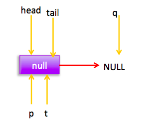

Do (3), there are 2 situations: one is when others does put any element the resulf of (3) will be true, then since h!=p is false so return null; another one is before do q=p.next, other threads has put one element to the queue, at this time do (3) will return false, then do (5) p=q, and after the loop will be like:  

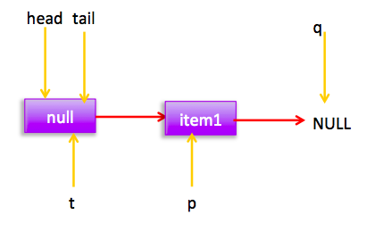

At this time, do (1) cas, set the value of current node to be null, only one thread can succeed, cas succeed means remove this node successfully. Then p!=h, invoke updateHead with paramenter h,p. So, ket p to be the head node, and next of h points to it self:

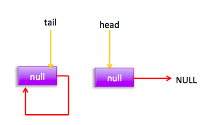

If CAS failed it will do loop again and will be:

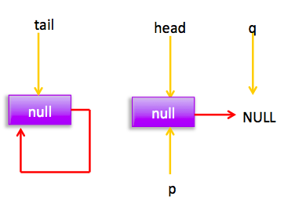	

At this time do (3) will return null. 

## 5. peek

The peek operation will get the element at the first place and do not remove it.

	public E peek() {
	    restartFromHead:
	    for (;;) {
	        for (Node<E> h = head, p = h, q;;) {
	            E item = p.item;
	            if (item != null || (q = p.next) == null) {
	                updateHead(h, p);
	                return item;
	            }
	            else if (p == q)
	                continue restartFromHead;
	            else
	                p = q;
	        }
	    }
	}

## 6. size

	public int size() {
	    int count = 0;
	    for (Node<E> p = first(); p != null; p = succ(p))
	        if (p.item != null)
	            // return Integer.MAX_VALUE
	            if (++count == Integer.MAX_VALUE)
	                break;
	    return count;
	}
	 
	//Get the first element, return null if there is none
	Node<E> first() {
	    restartFromHead:
	    for (;;) {
	        for (Node<E> h = head, p = h, q;;) {
	            boolean hasItem = (p.item != null);
	            if (hasItem || (q = p.next) == null) {
	                updateHead(h, p);
	                return hasItem ? p : null;
	            }
	            else if (p == q)
	                continue restartFromHead;
	            else
	                p = q;
	        }
	    }
	}
	 
	//Get the next of the current node
	final Node<E> succ(Node<E> p) {
	    Node<E> next = p.next;
	    return (p == next) ? head : next;
	}