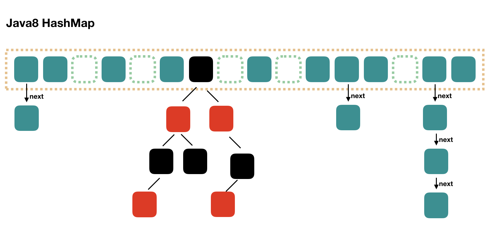

## 1. Introduction
In Java 8, HashMap has been redesigned. The most different point is the usage of Red-Black-Tree, so HashMap in Java 8 is comprised of array, linked list and Red-Black-Tree. 
I have introduced HashMap in Java 7 that when we want to find a value, we need to find index of array firstlym the iterate a linked list. And, the runtime of iteration of linked list is O(N). To solve this problem, In Java 8, the linked list in Java 7 is replace with Red-Black-Tree when the number of elements is over 8.    
The following picture will show you the constructure:

Then I will show you the source code. In Java 7, we use Entry to present every element in HashMap, nd In Java 8 we use Node. They are almost the same that both of them are comprised of key, value, hash and next. But if the constructure is Red-Black-Tree, then we use TreeNode.

## 2. Put

	public V put(K key, V value) {
	    return putVal(hash(key), key, value, false, true);
	}
	
	// if the 3rd parameter onlyIfAbsent is true, then do the put only when the key does not exist
	final V putVal(int hash, K key, V value, boolean onlyIfAbsent,
	               boolean evict) {
	    Node<K,V>[] tab; Node<K,V> p; int n, i;
	    // when put at the first time, it will invoke resize() to initial length of array
	    if ((tab = table) == null || (n = tab.length) == 0)
	        n = (tab = resize()).length;
	    // find the index of array, if there are none, then initail the next Node and put it in here
	    if ((p = tab[i = (n - 1) & hash]) == null)
	        tab[i] = newNode(hash, key, value, null);
	
	    else {// if exists data in this position
	        Node<K,V> e; K k;
	        // judge whether data we want to put equals to the data in the first place
	        if (p.hash == hash &&
	            ((k = p.key) == key || (key != null && key.equals(k))))
	            e = p;
	        // if it is a node of Red-Black-Tree, the use put of Red-Black-Tree
	        else if (p instanceof TreeNode)
	            e = ((TreeNode<K,V>)p).putTreeVal(this, tab, hash, key, value);
	        else {
	            for (int binCount = 0; ; ++binCount) {
	                // put into the last of linked list
	                if ((e = p.next) == null) {
	                    p.next = newNode(hash, key, value, null);
	                    // TREEIFY_THRESHOLD is 8, so, the number of elements is over 8, then turn the linked list into Red-Black-Tree
	                    if (binCount >= TREEIFY_THRESHOLD - 1) // -1 for 1st
	                        treeifyBin(tab, hash);
	                    break;
	                }
	                if (e.hash == hash &&
	                    ((k = e.key) == key || (key != null && key.equals(k))))
	                    break;
	                p = e;
	            }
	        }
	        if (e != null) {
	            V oldValue = e.value;
	            if (!onlyIfAbsent || oldValue == null)
	                e.value = value;
	            afterNodeAccess(e);
	            return oldValue;
	        }
	    }
	    ++modCount;
	    // If it is over threshold, then do rehash
	    if (++size > threshold)
	        resize();
	    afterNodeInsertion(evict);
	    return null;
	}

The differenct between Java 7 and 8 is that In java 7 do rehash the put and In Java 8 do put then rehash. 

## 3. Resize

	final Node<K,V>[] resize() {
	    Node<K,V>[] oldTab = table;
	    int oldCap = (oldTab == null) ? 0 : oldTab.length;
	    int oldThr = threshold;
	    int newCap, newThr = 0;
	    if (oldCap > 0) { 
	        if (oldCap >= MAXIMUM_CAPACITY) {
	            threshold = Integer.MAX_VALUE;
	            return oldTab;
	        }
	        // double the array
	        else if ((newCap = oldCap << 1) < MAXIMUM_CAPACITY &&
	                 oldCap >= DEFAULT_INITIAL_CAPACITY)
	            // double the threshold
	            newThr = oldThr << 1; // double threshold
	    }
	    else if (oldThr > 0) // 
	        newCap = oldThr;
	    else {
	        newCap = DEFAULT_INITIAL_CAPACITY;
	        newThr = (int)(DEFAULT_LOAD_FACTOR * DEFAULT_INITIAL_CAPACITY);
	    }
	
	    if (newThr == 0) {
	        float ft = (float)newCap * loadFactor;
	        newThr = (newCap < MAXIMUM_CAPACITY && ft < (float)MAXIMUM_CAPACITY ?
	                  (int)ft : Integer.MAX_VALUE);
	    }
	    threshold = newThr;
	
	    // use new length to init new array
	    Node<K,V>[] newTab = (Node<K,V>[])new Node[newCap];
	    table = newTab; // If it just inits a array then finished and return the newTab
	
	    if (oldTab != null) {
	        // iterate the old array and move data
	        for (int j = 0; j < oldCap; ++j) {
	            Node<K,V> e;
	            if ((e = oldTab[j]) != null) {
	                oldTab[j] = null;
	                // move single data
	                if (e.next == null)
	                    newTab[e.hash & (newCap - 1)] = e;
	                // move data in Red-Black-Tree
	                else if (e instanceof TreeNode)
	                    ((TreeNode<K,V>)e).split(this, newTab, j, oldCap);
	                else { 
	                    Node<K,V> loHead = null, loTail = null;
	                    Node<K,V> hiHead = null, hiTail = null;
	                    Node<K,V> next;
	                    do {
	                        next = e.next;
	                        if ((e.hash & oldCap) == 0) {
	                            if (loTail == null)
	                                loHead = e;
	                            else
	                                loTail.next = e;
	                            loTail = e;
	                        }
	                        else {
	                            if (hiTail == null)
	                                hiHead = e;
	                            else
	                                hiTail.next = e;
	                            hiTail = e;
	                        }
	                    } while ((e = next) != null);
	                    if (loTail != null) {
	                        loTail.next = null;
	                        // the first linked list
	                        newTab[j] = loHead;
	                    }
	                    if (hiTail != null) {
	                        hiTail.next = null;
	                        newTab[j + oldCap] = hiHead;
	                    }
	                }
	            }
	        }
	    }
	    return newTab;
	}

## 4. Get
Get is easy.

1. compute hash value of key, find index in array accoding hash value.
2. judge whether the data we want is in the array, if not do 3rd step.
3. judge whether type of the data is TreeNode, do put of Red-Black-Tree if true, do 4th step if not.
4. iterate linkedl list until find the key. 
