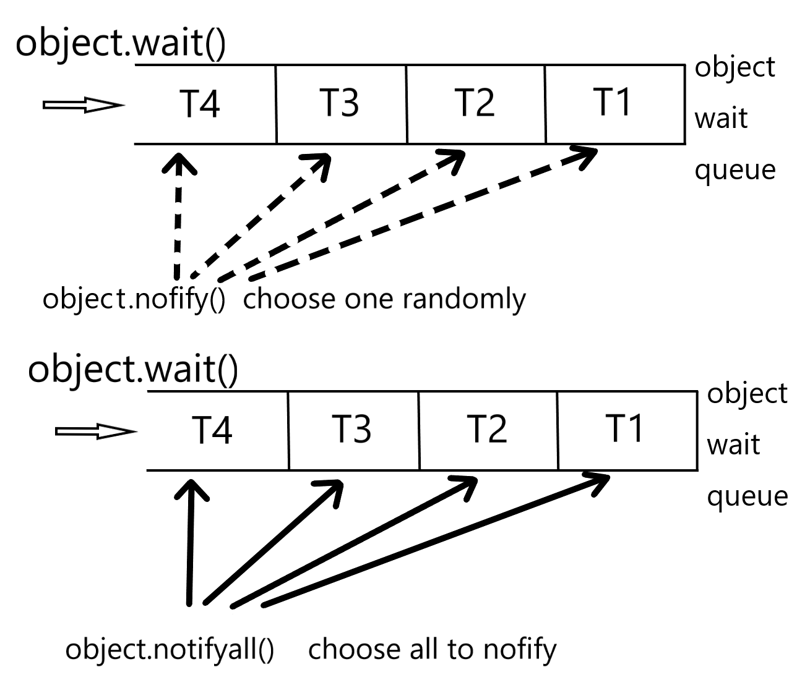

## 1 Something About Thread
Before I introduce thread, I'd like to introduce its mother process. At earlier time, Process is the fundamental executin unit. At the modern thread design, process is the docker of thread. Different Processed share no main memory but different threads of one process shared main memory. 
The following picture will show yout the life time of thread.

Status of thread is defined in the enum

	public enum State{
		NEW,
		RUNNABLE,
		BLOCKED,
		WAITING,
		TIMED_WAITING,
		TERMINATED;
	}

NEW status means created thread which still not run even one time. Until stat() is invoked, thread starts. If a thread meets synchronized block when running, then this thread will go into BLOCKED status and stop running until get the lock to unlock. Both WAITING and TIMED_WAITING means waiting status. The difference is that WAITING means wait in no limited time and TIMED_WAITING means wait in limited time. You may wonder what threads wait for. Generally speaking, WAITING threads wait for some special event like notify(). When threads finish execution, its status will be TERMINATED.

>  From NEW status starting means never get back to NEW and is the same to RUNNABLE.

# 2 Thread Basic Using
To learn to use concurrency, you need to learn its API first. In this section I will show you about it.
## 2.1 Create Thread
It's east to create one thread. Just use 'new' to create one thread and use start() to run it.

	Thread thread1 = new Thread();
	thread1.start();

What it will do affer start() is the point. In Thread class, there is a run() function and start() will create one new thread and do the run(). 
Here is an attention: the following code can be compiled and runned, but it just does run() of the current thread and not create one new thread.

	Thread thread1 = new Thread();
	thread1.run();

So, there is a big difference between start() and run(). 
In the default situation, run() of Thread class does nothing. So, we need to Override the run() function. 

	Thread thread1 = new Thread(){
		@Override
		public static run(){
			system.out.println("Hello, this is thread1");
		}
	};
	thread1.start();

The codes above use an anonymous class and overaride run() which us "system.out.println("Hello, this is thread1");". As we know in java there is only a single "extend", which means is a rare resources. So, we can use an interface called "Runnable" to do it. In Runnable, there is only one function "run()". 

	public interface Runnable{
		public abstract void run();
	}

Besides, in Thread class there is a important construction function.

	public Thread(Runnable target);

It will pass a Runnable instance and when start() is invoked the new thread will do Runnable.run(). In the source code is like the following 

	public Thread(Runnable target) {
        init(null, target, "Thread-" + nextThreadNum(), 0);
    }

The following will show you one case of uee Runnable

	public class NewThreadUsingRannable implements Runnable{
		public static void main(String[] args) {
	        Thread t1 = new Thread(new NewThreadUsingRannable());
	        t1.start();	
	  	}
		@Override
		public void run(){
			System.out.println("This is using Runnable interface");
    	}
	}

## 2.2 Stop Thread
You can use stop() to stop one thread. But in multi-thread situation I sugeest not to use it. The reason is since it will stop one thread immediately, concurrency may happen. For example, there are 2 datas:

>data1: Id=1, Name=tokyo; 
>data2: Id=2, Name=kyoto;

If will write data1 to the database and it stop when finished with Id but not with Name. That means we get only half of data1 in the database. Then write data2 into database, the result may be:

>data1: Id=1, Name=kyoto; 
>data2: Id=2, Name=null;

The following picture will show you why

## 2.3 Interrupt Thread
As I said in 2.3, stop() function has some problems, so there is another function called interrupt. Interrupt will notice a thread that "You show quit". What the will the thread do depends on the thread it self. About  interrupt, there are 3  functions

	public void Thread.interrupt()  // interrupt a thread
	public boolean Thread.isInterrupted()  // judge whether a thread is interrupted
	public static boolean Thread.interrupted()  // judge whether a thread is interrupted and clear  all interrupt status

Thread.interrupt() is a function of a instance which will interrupt one thread (means set interrupted flag). Thread.isInterrupted() is a function of a instance too and it will judge whether the thread is interrupted. So, what will the following codes do?

    public static void main(String[] args) throws InterruptedException {
        Thread thread1 = new Thread(){
            @Override
            public void run(){
                while (true){
                    Thread.yield();
                }
            }
        };
        thread1.start();
        Thread.sleep(2000);
        thread1.interrupt();
    }

Here, apparently thread1 is interrupted but there is no logic codes in interruption of thread1. So, thread1 is interrupted and will do nothing. 
If you hope thread1 will quit when interrupt, the do like the following code.

    public static void main(String[] args) throws InterruptedException {
        Thread thread1 = new Thread(){
            @Override
            public void run(){
                while (true){
                    if(Thread.currentThread().isInterrupted()){
                        System.out.println("it is interrupted");
                        break;
                    }
                    Thread.yield();
                }
            }
        };
        thread1.start();
        Thread.sleep(2000);
        thread1.interrupt();
    }

## 2.5 wait and notify
For cooperation of threads, JDK provides 2 important interface wait() and notify(). These 2 functions are not in Thread class but in Obeject class. That means any object cab use them. 
The signature is like the following:

	public final void wait() throws InterrruptedException
	public final native void notify()

When a instance invokes wait(), the current thread will wait on this instance. What does that means? For example, thread A invokes obj.wait(), then thread A will stop operating and tuen status into WAIT. So, when will this end? Until another thread invokes obj.wait(). So, this obj instance is a way to communicate between threads. 
So, how does wait() and notify() work? The following picture will show you this.
 
If a thread use object.wait(), then it will go into wait queue of the object instance. In this wait queue, numbers of threads may in it, because numbers of threads are wait for one object. When object.notify() is invoked, it will choose one randomly to notify. Here, the choosing is not fair. 
Besides notify(), there is another method named notifyall() in object instance. The difference is that it will nofity all threads. 
One point needed to be emphasized is that object.wait() can not be invoked at any time. It must be in synchronized block, no matter wait() or nofity(), it needs a monitor of a object. Here is a example of it:

	public class WaitAndNofity {
	    final static Object object = new Object();
	    public static class T1 extends Thread{
	        public void run(){
	            synchronized (object){
	                System.out.println(System.currentTimeMillis()+":T1 start.");
	                try {
	                    System.out.println(System.currentTimeMillis()+"T1 wait for object.");
	                    object.wait();
	                }catch (InterruptedException e){
	                    e.printStackTrace();
	                }
	                System.out.println(System.currentTimeMillis()+"T1 end.");
	            }
	        }
	    }
	    public static class T2 extends Thread{
	        public void run(){
	            synchronized (object){
	                System.out.println(System.currentTimeMillis() +"T2 start.");
	                object.notify();
	                System.out.println(System.currentTimeMillis()+"T2 end.");
	                try {
	                    Thread.sleep(2000);
	                }catch (InterruptedException e){
	                    e.printStackTrace();
	                }
	            }
	        }
	    }
	
	    public static void main(String[] args) {
	        Thread t1 = new T1();
	        Thread t2 = new T2();
	        t1.start();
	        t2.start();
	    }
	}

Then, run the code and the result will be:

	1521272046986:T1 start.
	1521272046986T1 wait for object.
	1521272046986T2 start.
	1521272046986T2 end.
	1521272048987T1 end.

## 2.6 join and yield
At the most situation, input of one thread may depends on other threads. At this time, you can use join().Here are 2 join functinos:

	public final void join() throws InterruptedException
	public final synchronized void join(long millis) throws InterruptedException    

THe first one means wait forever until the targer thread has finished. The second one provides a waiting time, and if over it then go on. Here is a join() intance:

	public class JoinMain {
	    public volatile static int i = 0;
	    public static class addThread extends Thread{
	        @Override
	        public void run() {
	            for(i=0;i<10000000;i++);
	        }
	    }
	
	    public static void main(String[] args) throws InterruptedException {
	        addThread addThread = new addThread();
	        addThread.start();
	        addThread.join();
	        System.out.println(i);
	    }
	}

In the main function, if there is no join(), the i may less than 10000000. Since there is a join(), so the "System.out.println(i);" must wait for the addThread. That is the reason the outcome will be 10000000. 
About join, I want to say that in fact it invokes wait() on the current object.Here is a part of the source code in JDK:

	while(isAlinve()){
		wait(0)
	}

We can see that it let the invoking thread wait on current object. When the current thread finished, waited thread will invoke nofityall() to notify all waited thread to go on.

## 2.7 volatile and JMM
I have described JMM bebore and all JMM is about atomic thing. volatile is for that. So if you want to know something about vaolatile, just see my article about JMM.