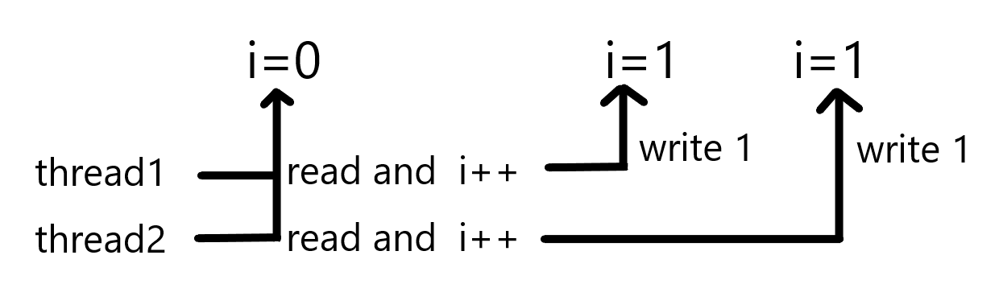

## 1 Thread Group
In a system, if the number of threads is too large and function of everyone is clear, then you can put threads with same function into a thread group. Here is a example o it:

	public class ThreadGroupName implements Runnable{
	    public static void main(String[] args) {
	        ThreadGroup tg = new ThreadGroup("PrintGroup");
	        Thread t1  = new Thread(tg, new ThreadGroupName(),"T1");
	        Thread t2  = new Thread(tg, new ThreadGroupName(),"T2");
	        t1.start();
	        t2.start();
	        System.out.println(tg.activeCount());
	        tg.list();
	    }
	
	    @Override
	    public void run() {
	        String groupAndName = Thread.currentThread().getThreadGroup().getName() +"-"+ Thread.currentThread().getName();
	        while (true){
	            System.out.println("I am "+ groupAndName);
	            try{
	                Thread.sleep(3000);
	            } catch (InterruptedException e) {
	                e.printStackTrace();
	            }
	        }
	    }
	}

In the 3rd line of the code, we build a thread group named PrintGroup and put T1 and T2 into it. In the line 8th and 9th of the code, it shows 2 functions of this thread group that activeCount() can gey bumber of active thread. In the 4th and 5th line of the code create 2 threads, and put them into a thread group. 
In thread group, stop() can be used and it will stop all threads in thread group. 

## 2 Daemon
The Daemon is a special thread just like its name that it will protect the system. It will finish a series jobs like GC, JIT thread and others. Besides Daemon in system is user threads which can be regarded as working threads and they will do jobs of its program. If user threads  finished their jobs, that means there is nothing they will do. The protected target is gone for Daemon, then the whole program will quit. So, in a java application, when only Daemon is in the system, then JVM will quit. Here is a example of Daemon:

	public class DaemonDemo {
	    public static class DaemonT extends Thread{
	        @Override
	        public void run(){
	            while (true){
	                System.out.println("I am alive");
	                try{
	                    Thread.sleep(1000);
	                } catch (InterruptedException e) {
	                    e.printStackTrace();
	                }
	            }
	        }
	    }
	
	    public static void main(String[] args) throws InterruptedException {
	        Thread t= new DaemonT();
	        t.setDaemon(true);
	        t.start();
	        Thread.sleep(2000);
	
	    }
	}

In the 16th line of the code, it sets t as Daemon. Here is a point that the setting must before start() or you will get a fail exception. But you program can still execute just be treated as user threads. 
In this example, because t is set as Daemon and only t in the main thread. So the sleep time is over, the whole program is over. But if you do not set t as Daemon, when the main thread is over, then the t thread will print forever. 

## 3 Priority
In java, thread can have its onw priority. Thread with high priority will get resources in a high probability. Since its a probability, so thread with high may fail to get resources. In java, there are 10 levels of priority and the higher priority with larger number. Here is a example of it.

	public class PriorityDemo {
	    public static class HightPriority extends Thread{
	        static int count = 0;
	        @Override
	        public void run(){
	            while(true){
	                synchronized (PriorityDemo.class){
	                    count++;
	                    if(count>10000000){
	                        System.out.println("Hight priority is done");
	                        break;
	                    }
	                }
	            }
	        }
	    }
	    public static class LowPriority extends Thread{
	        static int count = 0;
	        @Override
	        public void run(){
	            while(true){
	                synchronized (PriorityDemo.class){
	                    count++;
	                    if(count>10000000){
	                        System.out.println("Low priority is done");
	                        break;
	                    }
	                }
	            }
	        }
	    }
	
	    public static void main(String[] args) {
	        Thread high = new HightPriority();
	        Thread low = new LowPriority();
	        high.setPriority(Thread.MAX_PRIORITY);
	        low.setPriority(Thread.MIN_PRIORITY);
	        low.start();
	        high.start();
	    }
	}

In the code above, HightPrioirty with high priority and LowPrioirty with low priority and let them do the same work that count 0 to 10000000. When the word finished it will get a tip. Here is a point that we use synchronized to make them rob the resource. And the result is HightPrioirty  always fast than LowPrioirty.

## 4 Thread Safe and Synchronized
Thread safe is important in concurrent program. Mostly, useing concurrent program can get a high performance but let the satety into danger. The volatile is for the satefy but it is not enough since it just can assure only one thread safe. When 2 threads try to update one date, it will get problems. 
Here are codes about number count. Each of 2 threads counts on a i to do adding for 1000000 times. Of course we hope the result is 2000000 but in fact it's not. You will find that at most of time the result is less than 2000000. The reason is that you use 2 threads to do add and one may override another even the i is volatile. 

	public class AccountingVol implements Runnable{
	    static AccountingVol instance = new AccountingVol();
	    static volatile int i = 0;
	
	    public static void increase(){
	        i++;
	    }
	    @Override
	    public void run() {
	        for(int j=0;j<1000000;j++){
	        increase();
	        }
	    }
	
	    public static void main(String[] args) throws InterruptedException {
	        Thread t1 = new Thread(instance);
	        Thread t2 = new Thread(instance);
	        t1.start();
	        t2.start();
	        t1.join();
	        t2.join();
	        System.out.println(i);
	    }
	}

The following picture show how this happened. Each of t1 and t2 read i and get a value of 0 and do adding to 1 then write back into i, so the adding has been doing 2 times but the value of i is 1.
 
To totally solve this problem, we need to make sure that all operations on i of all threads should be synchronized. That is to say when A is write into i, then B can not write and read. In java ,we use a key word named synchronized to implement it. 
It create a key on code only one thread which has the key can get into the code with the key to make sure the thread safe. 
There are 3 kinds of using:

- on object
- on instance function
- on staic function

  