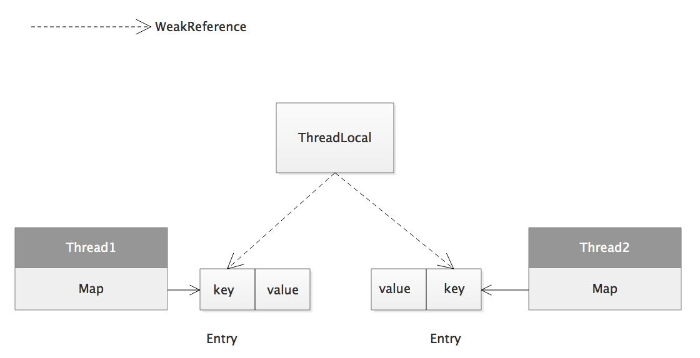

## 1 Introduction
The ThreadLocal is not a thread but a variable only can be used by current thread. So, it is a thread level variable. 
Every thread can hold more than one ThreadLocal instances, hash them then store them into ThreadLocalMap. The key is ThreadLocal instances and value is a replica of the current thread. 

From the picture we can see that ThreadLocal does not store value but key. 
Here is an example:

	public class ThreadLocalDemo {
	    public static void main(String []args){
	        for(int i=0;i<5;i++){
	            final Thread t = new Thread(){
	                @Override
	                public void run(){
	                    System.out.println("The current thread:"+Thread.currentThread().getName()+",ID:"+ThreadId.get());
	                }
	            };
	            t.start();
	        }
	    }
	    static   class ThreadId{
	        //an increasing order, use AtomicInger for thread safe
	        private static final AtomicInteger nextId = new AtomicInteger(0);
	        //ThreadLocal variable, every thread with a unique ID
	        private static final ThreadLocal<Integer> threadId =
	                new ThreadLocal<Integer>() {
	                    @Override
	                    protected Integer initialValue() {
	                        return nextId.getAndIncrement();// nextId++
	                    }
	                };
	
	       // return unique id of the current thread, if get first then initialValue
	        public static int get() {
	            return threadId.get();
	        }
	    }
	} 

The result is:

	The current thread:Thread-4,ID:1
	The current thread:Thread-0,ID:0
	The current thread:Thread-2,ID:3
	The current thread:Thread-1,ID:4
	The current thread:Thread-3,ID:2 

## 2 Source Code Learning
##### Set
Here is the source code:

	public void set(T value) {
    	Thread t = Thread.currentThread();//1.Get current thread instance first
    	    ThreadLocalMap map = getMap(t);//2.Get ThreadLocalMap of the current thread
    	    if (map != null)
    	        map.set(this, value);//If map is not null then set
        	else
            	createMap(t, value);//If map is null then create ThreadLocalMap
    }

We can see the ThreadLocal is just an entrance, the real value is binded with threads.

	ThreadLocalMap getMap(Thread t) {
	    return t.threadLocals;// Thread has the pointer to ThreadLocalMap
	}

The following is a difinition in Thread clas, and every thread haas a ThreadLocalMap instance. 
	
	ThreadLocal.ThreadLocalMap threadLocals = null;

Here we can see the design of ThreadLocal:

1. The ThreadLocal is just a entrance of variables 
2. Every thread instance has a ThreadLocalMap instance, this ThreadLocalMap has the point to the real value 
3. The ThreadLoca is key of ThreadLocalMap and value of ThreadLocalMap is the real data we want to store. When invoking get we can get the value we want at the current thread.  

By the way, this design has 2 benificial points that:

1. When threads are finished, instances can be GCed as soon as possible.
2. The number of elements of ThreadLocalMap will decrease, then the probability of hash coflict of Map will decrease.

##### Get
Here is the source code:

	public T get() {
	    Thread t = Thread.currentThread();//Get current thread instance first
        ThreadLocalMap map = getMap(t);//Get ThreadLocalMap of the current thread
        if (map != null) {//If map is not null then get Entry by usingkey
            ThreadLocalMap.Entry e = map.getEntry(this);
            if (e != null)
                return (T)e.value;
         }
         return setInitialValue();//If map is null then init it
     }

About setInitialValue(), the default value is null and can be overrided.

	protected T initialValue() {
        return null;
    }

