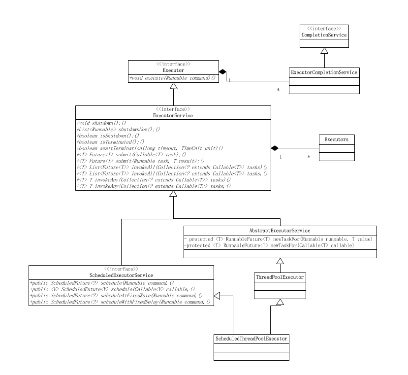

## 1. Reason Of Using ThreadPool
Persuming finish a service needs a runtime that it has: (1)T1:time of creating thread; (2)T2: time of doing task; (3)T3: time of destroying thread. If T1+T3>>>>>T2, then using ThreadPool will enhance performance of service.
So, what is the ThreadPool? The ThreadPool is like a pool of threads, when you want to use a thread then get one from the pool and return the thread back into pool when you finished your task. By this way, there is no runtime of creating thread and destroying thread. That is why it can enhance performance.

## 2. ThreadPool in Java
In java, it provides Executor to implement ThreadPool. Here is a structure of it.

Interface: Executor, CompletionService, ExecutorService, ScheduledExecutorService 
Abstract Class：AbstractExecutorService 
Class：ExecutorCompletionService, ThreadPoolExecutor, ScheduledThreadPoolExecutor 
From the picture we can see that the most important thing is the ThreadPoolExecutor.

##### ThreadPoolExecutor
Here is the constructor:

	public class ThreadPoolExecutor extends AbstractExecutorService {
    .....
    public ThreadPoolExecutor(int corePoolSize,int maximumPoolSize,long keepAliveTime,TimeUnit unit,
            BlockingQueue<Runnable> workQueue);
 
    public ThreadPoolExecutor(int corePoolSize,int maximumPoolSize,long keepAliveTime,TimeUnit unit,
            BlockingQueue<Runnable> workQueue,ThreadFactory threadFactory);
 
    public ThreadPoolExecutor(int corePoolSize,int maximumPoolSize,long keepAliveTime,TimeUnit unit,
            BlockingQueue<Runnable> workQueue,RejectedExecutionHandler handler);
 
    public ThreadPoolExecutor(int corePoolSize,int maximumPoolSize,long keepAliveTime,TimeUnit unit,
        BlockingQueue<Runnable> workQueue,ThreadFactory threadFactory,RejectedExecutionHandler handler);
	.....
	}

corePoolSize: size of core pool, when pool is created there is no thread. When there are tasks coming then create threads to do tasks. When number of threads equal to corePoolSize, the latter will be put in to queue. That means the corePoolSize is the max size of parallel tasks. If invoke prestartAllCoreThreads(), then the ThreadPool will create all core threads in advance. 

maximumPoolSize: Max size of ThreadPool, it means how many threads can be created. The MaximumPoolSize must >= corePoolSize. 

keepAliveTime: Means how much time thread can be existing without any task. In default, only when number of threads in ThreadPool is larger than corePoolSize, the keepAliveTime will work. In other words, when number of threads in ThreadPool is larger than corePoolSize, and one thread without tasks has been existing for more than keepAliveTime, then shutdown. 

Unit: Unit of keepAliveTime. There are 7 types:

	TimeUnit.DAYS;              
	TimeUnit.HOURS;         
	TimeUnit.MINUTES;       
	TimeUnit.SECONDS;      
	TimeUnit.MILLISECONDS;   
	TimeUnit.MICROSECONDS;    
	TimeUnit.NANOSECONDS;       

workQueue: It is a blocking queue, used for stored tasks that waiting to be executed. When number of threads in ThreadPool is larger than corePoolSize, threads will be put into block queue to wait. Through workQueue the ThreadPool implements this function.There are 3 types:

	ArrayBlockingQueue;
	LinkedBlockingQueue;
	SynchronousQueue;

threadFactory: It is used for creating threads. 

handler: It is the strategy when refuse to execute tasks. 

##### AbstractExecutorService
We can see that ThreadPoolExecutor extends AbstractExecutorService, here is the implementation of AbstractExecutorService:

	public abstract class AbstractExecutorService implements ExecutorService {
	 
	    protected <T> RunnableFuture<T> newTaskFor(Runnable runnable, T value) { };
	    protected <T> RunnableFuture<T> newTaskFor(Callable<T> callable) { };
	    public Future<?> submit(Runnable task) {};
	    public <T> Future<T> submit(Runnable task, T result) { };
	    public <T> Future<T> submit(Callable<T> task) { };
	    private <T> T doInvokeAny(Collection<? extends Callable<T>> tasks,
	                            boolean timed, long nanos)
	        throws InterruptedException, ExecutionException, TimeoutException {
	    };
	    public <T> T invokeAny(Collection<? extends Callable<T>> tasks)
	        throws InterruptedException, ExecutionException {
	    };
	    public <T> T invokeAny(Collection<? extends Callable<T>> tasks,
	                           long timeout, TimeUnit unit)
	        throws InterruptedException, ExecutionException, TimeoutException {
	    };
	    public <T> List<Future<T>> invokeAll(Collection<? extends Callable<T>> tasks)
	        throws InterruptedException {
	    };
	    public <T> List<Future<T>> invokeAll(Collection<? extends Callable<T>> tasks,
	                                         long timeout, TimeUnit unit)
	        throws InterruptedException {
	    };
	} 

##### ExecutorService
AbstractExecutorService is an abstract class, it implements ExecutorService interface. So let's see the implementation of xecutorService interface:

	public interface ExecutorService extends Executor {
	 
	    void shutdown();
	    boolean isShutdown();
	    boolean isTerminated();
	    boolean awaitTermination(long timeout, TimeUnit unit)
	        throws InterruptedException;
	    <T> Future<T> submit(Callable<T> task);
	    <T> Future<T> submit(Runnable task, T result);
	    Future<?> submit(Runnable task);
	    <T> List<Future<T>> invokeAll(Collection<? extends Callable<T>> tasks)
	        throws InterruptedException;
	    <T> List<Future<T>> invokeAll(Collection<? extends Callable<T>> tasks,
	                                  long timeout, TimeUnit unit)
	        throws InterruptedException;
	 
	    <T> T invokeAny(Collection<? extends Callable<T>> tasks)
	        throws InterruptedException, ExecutionException;
	    <T> T invokeAny(Collection<? extends Callable<T>> tasks,
	                    long timeout, TimeUnit unit)
	        throws InterruptedException, ExecutionException, TimeoutException;
	}

##### Executor
ExecutorService extends Executor interface, so let's see implementation of Executor:

	public interface Executor {
	    void execute(Runnable command);
	}

##### Constructure 
I think you have understand the relationship of ThreadPoolExecutor, AbstractExecutorService, ExecutorService and Executor.

Executor is a top interface and only a function "execute(Runnable)" is in there. The return of the "execute(Runnable)"  is void and its parameter is a Runnable class, which means you will pass a task into it. Then, ExecutorService extends Executor interface and define some functions like: submit, invokeAll, invokeAny and shutDown. AbstractExecutorService implementes ExecutorService interface, it implements all functions of ExecutorService. Then, ThreadPoolExecutor extends AbstractExecutorService. 

In ThreadPoolExecutor, there are some important functions: 

	execute()
	submit()
	shutdown()
	shutdownNow()

The execute() is defined in Executor and implemented in ThreadPoolExecutor. This function is a core function of ThreadPoolExecutor. Through it you can pass a task to let a thread do it.  
submit() is defined in ExecutorService and implemented in AbstractExecutorService. It is like "execute()" that it can pass a task too. But the difference is "submit()" can get a return. 
The shutdown() and shutdownNow() are yused for closing threads.

## 3. Learning ThreadPool in Detail
### 3.1 runState Of ThreadPool
In ThreadPoolExecutor there is a volatile variable and some static final variables represent status of threads: 

	volatile int runState;
	static final int RUNNING    = 0;
	static final int SHUTDOWN   = 1;
	static final int STOP       = 2;
	static final int TERMINATED = 3;

The runState is state of the current ThreadPool, it uses volatile to assure the visibiliry. Here is the static final variables:
- When ThreadPool is created, it is in RUNNING state
- When invoke shutdown(), it is in SHUTDOWN state. At this time the ThreadPool can not get any new task and will wait on all task having finished.
- When invoke shutdownNow(), it is in STOP state. At this time the ThreadPool can not get any new task and will try to stop the tasks which is being executed.
- When the state is SHUTDOWN or STOP, and all working threads has been destroyed, after clear block queue, the state will be TERMINATED.  

### 3.2 Task Execution
Let's some important variables in ThreadPoolExecutor class

	private final BlockingQueue<Runnable> workQueue;
	private final ReentrantLock mainLock = new ReentrantLock();                                                        
	private final HashSet<Worker> workers = new HashSet<Worker>();
	private volatile long  keepAliveTime;    
	private volatile boolean allowCoreThreadTimeOut;  
	private volatile int   corePoolSize;  
	private volatile int   maximumPoolSize;
	private volatile int   poolSize;       
	private volatile RejectedExecutionHandler handler; 
	private volatile ThreadFactory threadFactory;   
	private int largestPoolSize;  
	private long completedTaskCount;

I have introduced corePoolSize, maximumPoolSize, poolSize, workQueue, handler, keepAliveTime and ThreadFactory.

### 3.3 Initial ThreadPool
In default, when ThreadPool is created, there is no threads in it until tasks has been put into it. If you want to create threads after creating ThreadPoll immediately, there are 2 functions:
	
	public boolean prestartCoreThread() {
	    return addIfUnderCorePoolSize(null); 
	}
	 
	public int prestartAllCoreThreads() {
	    int n = 0;
	    while (addIfUnderCorePoolSize(null))
	        ++n;
	    return n;
	}

### 3.4 Queue

I have mentioned queue from time to time, that is workQueue, and it is used for storing tasks that are waiting for being executed. There are 3 types of it:

- ArrayBlockingQueue: It is based on a first in first out array, this queue must define a size.
- LinkedBlockingQueue: It is based on a first in first out LinkedList, if you do not define a size, then the size will be Integer.MAX_VALUE.
- synchronousQueue: This is a special queue that it won't store tasks but create a new thread to do tasks.

### 3.5 Task Rejected Strategy
When the queue is full and the number of threads is maximumPoolSize, then the latter tasks will be refused. Here are the 4 strategies:

	ThreadPoolExecutor.AbortPolicy: Give up this task and throw RejectedExecutionException
	ThreadPoolExecutor.DiscardPolicy: Give up this task and do not throw Exception
	ThreadPoolExecutor.DiscardOldestPolicy:Give up the task at the frontest queue and do tasks execution again
	ThreadPoolExecutor.CallerRunsPolicy: Let the invoking thread do this task

### 3.6 Shutdown of ThreadPool
For shotdown ThreadPool, ThreadPoolExecutor provides 2 functions: shutdown()和shutdownNow(). I have already introduced them.

### 3.7 Volume Of ThreadPool
For changing volume Of ThreadPool, ThreadPoolExecutor provides 2 functions: setCorePoolSize() and setMaximumPoolSize():

- setCorePoolSize：Set size of CorePool
- setMaximumPoolSize：Set size of the max mumber of threads

### Demo
Here first is a fundamental demo:

	public class ThreadPoolDemo {
	    public static class MyTask implements Runnable{
	        @Override
	        public void run() {
	            System.out.println(System.currentTimeMillis()+":Thread ID:"+Thread.currentThread().getId());
	            try{
	                Thread.sleep(1000);
	            } catch (InterruptedException e) {
	                e.printStackTrace();
	            }
	        }
	    }
	
	    public static void main(String[] args) {
	        MyTask task = new MyTask();
	        ExecutorService es = Executors.newFixedThreadPool(5);
	        for(int i =0;i<10;i++){
	            es.submit(task);
	        }
	    }
	}
