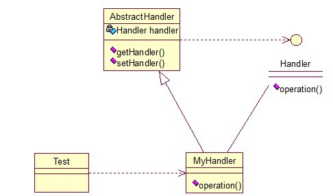

## Chain of Responsibility
In object-oriented design, the chain-of-responsibility pattern is a design pattern consisting of a source of command objects and a series of processing objects.Each processing object contains logic that defines the types of command objects that it can handle; the rest are passed to the next processing object in the chain. A mechanism also exists for adding new processing objects to the end of this chain. Thus, the chain of responsibility is an object oriented version of the if ... else if ... else if ....... else ... endif idiom, with the benefit that the condition–action blocks can be dynamically rearranged and reconfigured at runtime.

Here is the java code example:

interface Handler

	public interface Handler {  
	    public void operator();  
	}  

abstract class AbstractHandler

	public abstract class AbstractHandler {  
	      
	    private Handler handler;  
	  
	    public Handler getHandler() {  
	        return handler;  
	    }  
	  
	    public void setHandler(Handler handler) {  
	        this.handler = handler;  
	    }      
	} 

class MyHandler 
	
	public class MyHandler extends AbstractHandler implements Handler {  
	  
	    private String name;  
	  
	    public MyHandler(String name) {  
	        this.name = name;  
	    }  
	  
	    @Override  
	    public void operator() {  
	        System.out.println(name+"deal!");  
	        if(getHandler()!=null){  
	            getHandler().operator();  
	        }  
	    }  
	}  

Then do the test

	public class Test {  
	  
	    public static void main(String[] args) {  
	        MyHandler h1 = new MyHandler("h1");  
	        MyHandler h2 = new MyHandler("h2");  
	        MyHandler h3 = new MyHandler("h3");  
	  
	        h1.setHandler(h2);  
	        h2.setHandler(h3);  
	  
	        h1.operator();  
	    }  
	}  