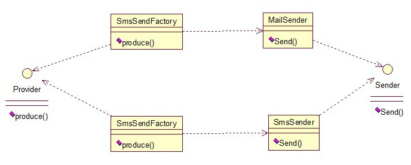

## AbstractFactory
The abstract factory pattern provides a way to encapsulate a group of individual factories that have a common theme without specifying their concrete classes.

Here is the Java code example:

interface Provider

	public interface Provider {
	    public Sender produce();
	}

interface Sender

	public interface Sender {
	    public void send();
	}

class SmsSender 

	public class SmsSender implements Sender {
	    @Override
	    public void send(){
	        System.out.println("This is createtypepattern.builder.SmsSender");
	    }
	}

class MailSender

	public class MailSender implements Sender {
	    @Override
	    public void send(){
	        System.out.println("This is Mailsender");
	    }
	}

class SendMailFactory

	public class SendMailFactory implements Provider{
	    @Override
	    public Sender produce(){
	        return new MailSender();
	    }
	}

class SendSmsFactory

	public class SendSmsFactory implements Provider{
	    @Override
	    public Sender produce() {
	        return new SmsSender();
	    }
	}

Then do the test

	public class MailSender implements Sender {
	    @Override
	    public void send(){
	        System.out.println("This is Mailsender");
	    }
	}
