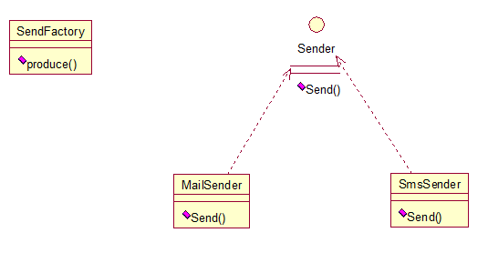

## Factory
In class-based programming, the factory method pattern is a creational pattern that uses factory methods to deal with the problem of creating objects without having to specify the exact class of the object that will be created. This is done by creating objects by calling a factory method—either specified in an interface and implemented by child classes, or implemented in a base class and optionally overridden by derived classes—rather than by calling a constructor.

Here is the java code example:

interface Sender

	public interface Sender {
	    public void send();
	}

class SmsSender 

	public class SmsSender implements Sender {
	    @Override
	    public void send(){
	        System.out.println("This is SmssSender");
	    }
	}

public class 

	public class MailSender implements Sender {
	    @Override
	    public void send(){
	        System.out.println("This is Mailsender");
	    }
	}

public class 

	public class SenderFactory {
	    public static Sender MailSender(){
	        return new MailSender();
	    }
	    public static Sender SmsSender(){
	        return new SmsSender();
	    }
	}

Then do the test

	public class FactoryTest {
	    public static void main(String[] args) {
	        SenderFactory.SmsSender().send();
	        SenderFactory.MailSender().send();
	    }
	}