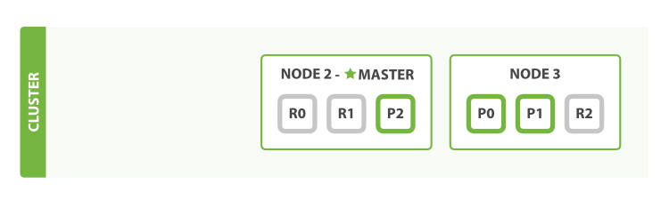

 
## Introduction
In Elasticsearch, we can extend our service by using vertical scale or scaling up, or even horizontal scale or scaling out.   

Here, I will describe cluster, node and shards of Elasticsearch. 

## empty cluster
If we start a single node and with no data and index, it will look like the following:

A node is an Elasticsearch instance and a cluster is made up of one or more nodes which share one cluster.name. When a node is added or deleted, the cluster will feel it and balance data. One of node will be elected as master which will be responsible for changing. The master node won't do indexing or searching of document.  Which means clients can connect to any node of a cluster. 

## cluster health
There are much infomation of cluster status, and the most important one is cluster health. There are 3 types of cluster health: green,yellow or red. 

We can do:

	GET /_cluster/health

Then we will get:

	{
	   "cluster_name":          "kincolle",
	   "status":                "green",
	   "timed_out":             false,
	   "number_of_nodes":       1,
	   "number_of_data_nodes":  1,
	   "active_primary_shards": 0,
	   "active_shards":         0,
	   "relocating_shards":     0,
	   "initializing_shards":   0,
	   "unassigned_shards":     0
	}

Here the status is green.

## index
For putting data into elasticsearch, we need index. In fact ,index is a user for pointing to one or more shards

A shard is the basic worker unit and it will store part of whole data. Elasticsearch will balance number of shards between nodes automatically. There a 2 types of shard:

- primary shard
- replica shard

Every document you index belong to a unique shard, so the number of primary shard define the number of document you can store.

The replica shard is just one replication of the primary shard to avoid missing data and it can be searched. When the index is created, the number of the primary shard is immutable but not the replica shard. 

Let's create a jin index in the unique empty cluster. The defualt situation, a index will have 5 primary shards. Here we set 3 primary shards and 1 replica shard:

	PUT /blogs
	{
	   "settings" : {
	      "number_of_shards" : 3,
	      "number_of_replicas" : 1
	   }
	}

From the picture we know 3 primary shards has been put into the node 1. Then let's check the cluster-health we will see:

	{
	   "cluster_name":          "kincolle",
	   "status":                "yellow", 
	   "timed_out":             false,
	   "number_of_nodes":       1,
	   "number_of_data_nodes":  1,
	   "active_primary_shards": 3,
	   "active_shards":         3,
	   "relocating_shards":     0,
	   "initializing_shards":   0,
	   "unassigned_shards":     3
	}

We know the status is yellow and 3 replica shards haven't been assigned. The yellow status means all primary shards is healthy but replica shards are not assigned completely. 

## another node
If we start the seconde node, it will lool like the following:

All primary nodes and replica shards have been assigned

Since the second node has been added into the cluset and all replica shards have been assigned. If we lost one node the cluster can still work well.

Let's see the status of the cluster:

	{
	   "cluster_name":          "kincolle",
	   "status":                "green",
	   "timed_out":             false,
	   "number_of_nodes":       2,
	   "number_of_data_nodes":  2,
	   "active_primary_shards": 3,
	   "active_shards":         6,
	   "relocating_shards":     0,
	   "initializing_shards":   0,
	   "unassigned_shards":     0
	}

## extension
If we extend out cluster and start the third node, the cluster will balance shards like the following:
 

Here node 3 get some shards from node 1 and node2, then every shard gets more hardware resources.

## changing replica shards

Like I heve described, the number of replica shards can be changed.Here we set the number from 1 to 2:

	PUT /blogs/_settings
	{
	   "number_of_replicas" : 2
	}

## lost node
If will lost one node, the cluster will be like the following:

If we lost a master node. For a cluster the master node is necessary. So the cluster will elect a new master node which is node 2. Since node 1 has losted, we can work without missing some primary shards. So we can get missing primary shards from replica shards. 
