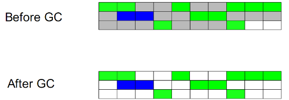
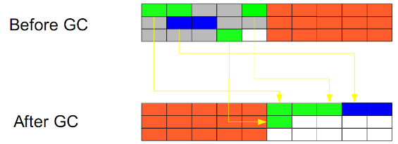
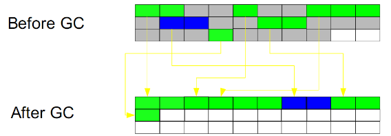

# Introduction

## Reference Counting
This is an ancient algorithm. When a reference is added, the count will plus 1 and minus 1 when a reference is deleted. So, whose count is 0 will be GCed. A circular reference will be a problem. 

## Mark-Sweep
Mark and Sweep algorithms use conceptually the simplest approach to garbage by just ignoring such objects. What this means is that after the marking phase has completed all space occupied by unvisited objects is considered free and can thus be reused to allocate new objects.

The approach requires using the so called free-list recording of every free region and its size. The management of the free-lists adds overhead to object allocation. Built into this approach is another weakness – there may exist plenty of free regions but if no single region is large enough to accommodate the allocation, the allocation is still going to fail (with an OutOfMemoryError in Java).

## Copying
Mark and Copy algorithms are very similar to the Mark and Compact as they too relocate all live objects. The important difference is that the target of relocation is a different memory region as a new home for survivors. Mark and Copy approach has some advantages as copying can occur simultaneously with marking during the same phase. The disadvantage is the need for one more memory region, which should be large enough to accommodate survived objects.

## Mark-Compact
Mark-Sweep-Compact algorithms solve the shortcomings of Mark and Sweep by moving all marked – and thus alive – objects to the beginning of the memory region. The downside of this approach is an increased GC pause duration as we need to copy all objects to a new place and to update all references to such objects. The benefits to Mark and Sweep are also visible – after such a compacting operation new object allocation is again extremely cheap via pointer bumping. Using such approach the location of the free space is always known and no fragmentation issues are triggered either.

 