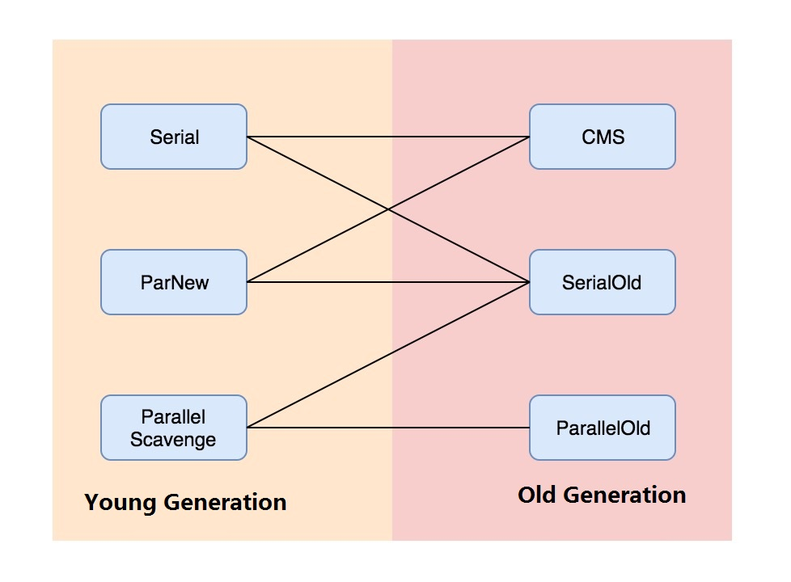
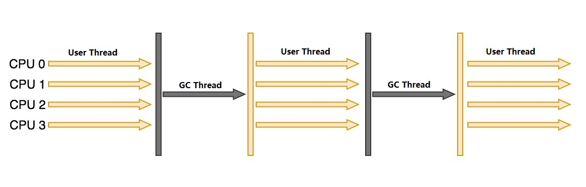
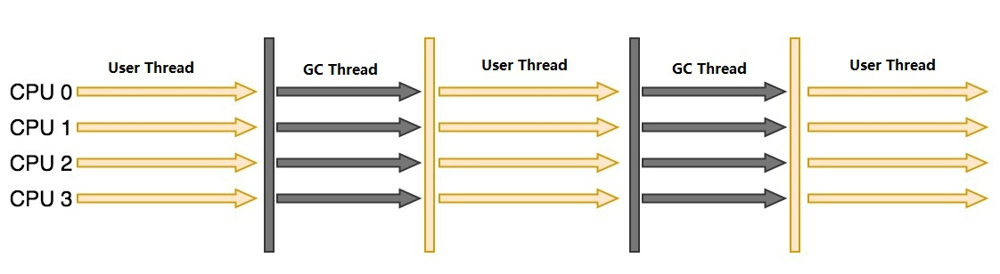
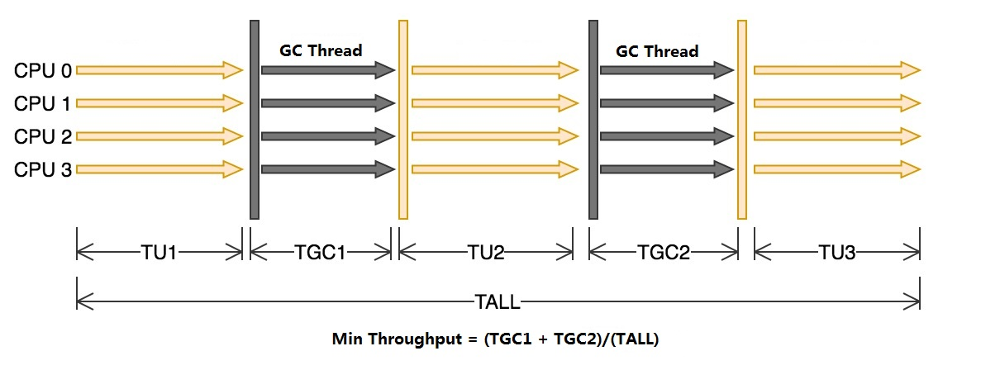

# Introduction
For garbage collector, we have collector for young generation and old generation.

## Serial
Serial Collector is for young generation, and it uses Mark-Copy algorithm. Since it has only one thread to do the collection, so it will stop all works which is call STW(Stop The World).
　　

 

## ParNew
The difference of ParNew from Serial is that it used multi-thread to do the collection. That means it does not need do STW.

## Parallel Scavenge 
Parallel Scavenge uses Mark-Copy algorithm. Parallel Scavenge concentrates on how to short the time of collecting.

