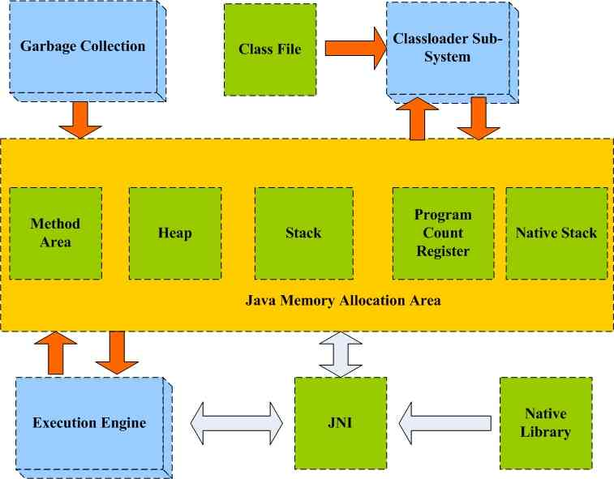
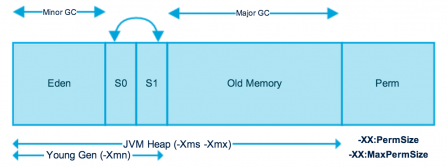

# Introduction
This is structure of JVM:

##### Heap
The most important in JVM is the heap because instance are stored in here and shared by all threads.

There are two parts in it: Young Generation and Old Generation. In the picture the Perm does not belong to the heap and it is deleted after JDK1.8.

GC in Young Generation is called Minor GC and In Old Generation is called Major GC.Most instance will be put into Eden area when it is build at the first time. When the Eden has enough instances, Minor GC will begin, then the survival instances will be put into one of the 2 Suvivor Places. At the same time, one of the 2 Suvivor Places should be empty. Atfer few times of Minor GC, survival instances will be moved into Old Generation. Will the place of Memory is not enough, we will get OutOfMemoryError exception.

Here let's one example:

	import java.util.ArrayList;
	import java.util.List;
	/* java -Xms20m -Xmx20m HeapOOM */
	public class HeapOOM {
	    static class OOMObject {
	    }
	    public static void main(String[] args) {
	        List<OOMObject> list = new ArrayList<OOMObject>();
	        while (true) {
	            list.add(new OOMObject());
	        }
	    }
	}

The result will be:
	
	Exception in thread "main" java.lang.OutOfMemoryError: Java heap space
	    at java.util.Arrays.copyOf(Arrays.java:3210)
	    at java.util.Arrays.copyOf(Arrays.java:3181)
	    at java.util.ArrayList.grow(ArrayList.java:261)
	    at java.util.ArrayList.ensureExplicitCapacity(ArrayList.java:235)
	    at java.util.ArrayList.ensureCapacityInternal(ArrayList.java:227)
	    at java.util.ArrayList.add(ArrayList.java:458)
	    at HeapOOM.main(HeapOOM.java:13)
## Method Area

Like the Heap, the Method Area is shared by all threads and it stores information of class, constants, static constants and so on. Even though it is descibed as one of heap, it is always called Non-Heap.

Before JDK1.8, we always called Method Area as Perm Generation, but they are not the same. And work of moving Perm Generation started from JDK1.7. In JDK1,7, part of Perm Generation has be moved into the Heap or the Native Heap. After JDK1.8, Perm Generation does not exist and we use metaspace. 

## Program Counter Register
It is a register in a computer processor that contains the address of the instruction being executed at the current time. 

## Native Method Stacks
It is near to The Stack but it is used for storing native methods. 