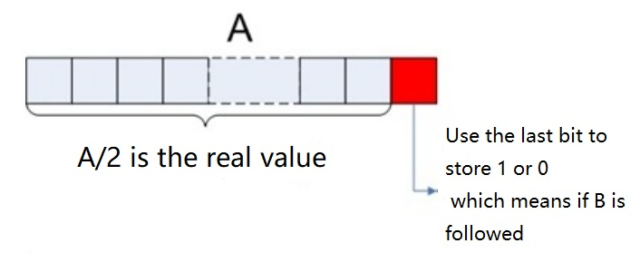

# A,B?

In lucene, there is a situation that after a value(for example A) there is a B or is not a B. So we need a flag to define whether if B exists. We can use a Byte after A to store 1 or 0 which means whether B exists. But, in fact, we can use a bit after A to store this value. This is the way lucene using.

