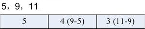

# Delta
In the index of Lucene, a lot of integer type data needed to be stored like ID.

If we store the VInt type, the space will be taken more if the number is bigger. The Delta means we can store the difference between the 2 numbers instead of storing the 2 numbers like the following.

if we want to store the following numbers:16386, 16387, 16388, 16389

In the usual way, the needed space will be:

	[(1) 000, 0010][(1) 000, 0000][(0) 000, 0001]，[(1) 000, 0011][(1) 000, 0000][(0) 000, 0001]，[(1) 000, 0100][(1) 000, 0000][(0) 000, 0001]，[(1) 000, 0101][(1) 000, 0000][(0) 000, 0001]

It is 12 Bytes.

By using Delta, the needed space will be:

	[(1) 000, 0010][(1) 000, 0000][(0) 000, 0001]，[(0) 000, 0001]，[(0) 000, 0001]，[(0) 000, 0001]

It is 6 Bytes.