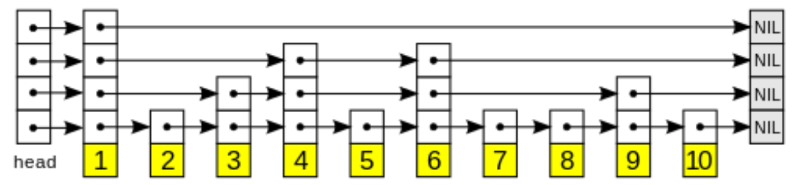

# Skip List
Skip lists are a probabilistic data structure that seem likely to supplant balanced trees as the implementation method of choice for many applications. Skip list algorithms have the same asymptotic expected time bounds as balanced trees and are simpler, faster and use less space. 

The probability of an element of ith layout show up at (i+1)th layout is P which is const. Usually, every element in 1/(1-p) linkedlists.