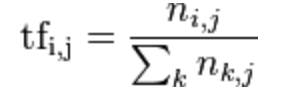
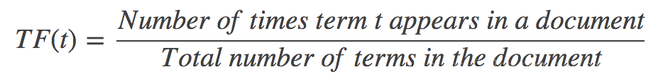
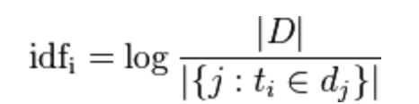
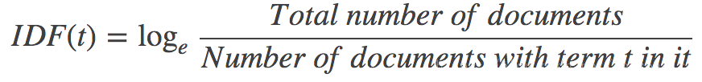

## TF
In a given document, TF means a frequency of a term in the document.

So it can be described like the following:

##IDF
IDF means how important a term is. is can be computed by using number of a term to be divided by the number of the documents.

So it can be described like the following:

Finally, it is:TF-IDF(t) = TF(t) * IDF(t).