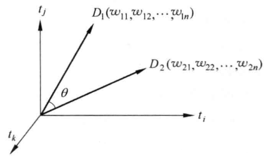
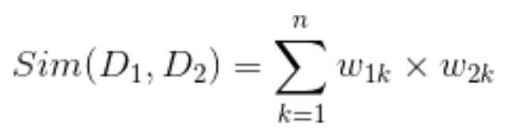
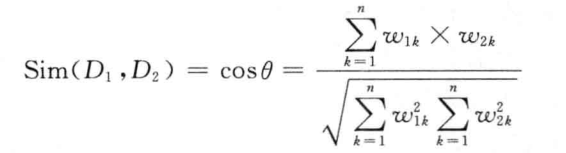

# Vector Space Model

In Vector Space Model, here is a document that D=D(t1w2;t2w1;...;tnwn), and there are 2 assumption:

(1) each term has no relationship

(2) there is no order for every term.

So, we can have a N dimension space for a document like the following:

## Cosine similarity
For 2 documents D1 and D2, their similarity Sim(D1,D2) can be computed like the following:

(1) We can 2 VSM for D1 and D2

D1=D(w11;w12;...;w1n)

D2=D(w21;w22;...;w2n)

(2) Then we can computing the similarity

(3) Also, we can use the COS

