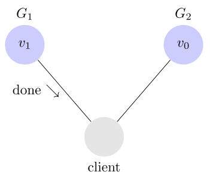
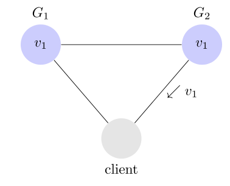

## Introduction of CAP theorem

Here is the introduction of CAP theorem in [wiki](https://en.wikipedia.org/wiki/CAP_theorem)

We have 3 guarantees

- Consistency
- Availability
- Partition tolerance

And only 2 of them can be satisfied at a same time.

## Partition tolerance
The system continues to operate despite an arbitrary number of messages being dropped (or delayed) by the network between nodes.

In the picture, G1 and G2 are 2 servers from 2 different areas. G1 can send a message to G2 but G2 may not receive it. This problem almost can not be avoided, so we can assume that P of CAP is always satisfied and one of C and A can not be satisfied

## Consistency 

The Consistency means after write a value you must be able to get the value you just write immediately. For example, a message is v0 and the client write V1 to G1

Then the read operation will get the V1.

The problem is, client do read from G2 and get a value of v0. So the Consistency is not satistied.

To get the v1 from G2, you must let G1 send a message to G2 when write v1 to G1. then the value of G2 will be v1.

Then the Consistency will be satisfied. 

## Availability

It means every request can receive a response that is not an error. So the client can read from G1 or G2 and must get a value.

## Consistency and Availability 
Why the Consistency and the Availability can not be satisfied at the same time when the Partition tolerance is satisfied?

When the Consistency is satisfied, it means opetation of G2 must be locked when you write a value into G1. After the right value has benn writen into both G1 and G2, then G2 can be unlocked.

If you want to satisfy the Availability which means do not lock the G2, then the Consistency can not be satisfied. 