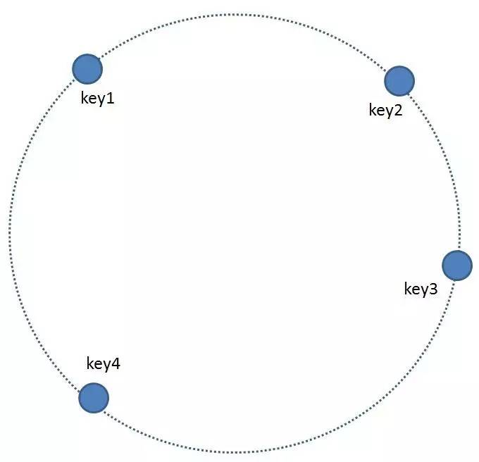

## Introduction of Consistent Hashing Algorithm
The Consistent hashing can guarantee that when a node is removed, only the keys stored in it will be rehashed; when a new node is added, only a fairly few keys will be rehashed.

##### Hash space
Commonly, a hash function will map a value into a 32-bit key, 0~2^32-1. Now imagine mapping the range into a circle, then the key will be wrapped, and 0 will be followed by 2^32-1.

##### Map key into hash space
Now consider four key1: key1~key4. We use a hash function to get their key values and map them into the circle, as illustrated in the following picture.

 
##### Map the node into hash space
The basic idea of consistent hashing is to map the node and keys into the same hash space using the same hash function. Now consider we have 4 nodes, node1, node2, node3 and node4, and then the mapping result will look like in the following picture.

##### Map keys into node
Now all the nodes and keys are hashed into the same space, so we can determine how to map keys into nodes. Take key for example, just start from where key is and head clockwise on the ring until you find a server. If that server is down, you go to the next one, and so forth. See the picture above. According to the method, key1 will be stored into node1; key2 and key3 will be stored into node2, and key4 will be stored into node3.

##### Add node
A new node4 is added

Since node4 is hashed between node1 and node2 in the ring, then only the keys that are between node1 and node2 will be rehashed; in the example, key2 will be stored in node4, illustrated in the following picture.

##### Remove node 
node3 is removed

Since node3 is removed, then only the keys that in node3 will be rehashed and moved to node1; in the example, see key4 illustrated in the following picture.

