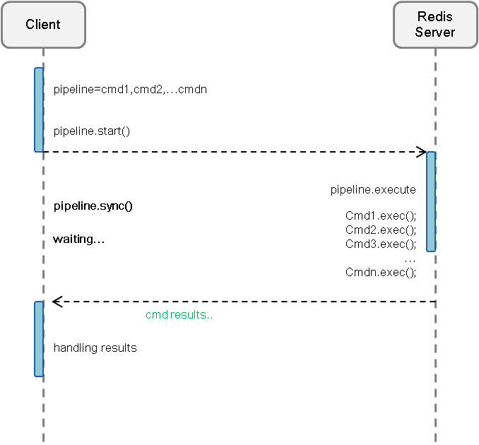

## Introduction of Pipeline
A Request/Response server can be implemented so that it is able to process new requests even if the client didn't already read the old responses. This way it is possible to send multiple commands to the server without waiting for the replies at all, and finally read the replies in a single step.

This is called pipelining, and is a technique widely in use since many decades. For instance many POP3 protocol implementations already supported this feature, dramatically speeding up the process of downloading new emails from the server.

##### Without Pipeline redis will work like the following:

##### With Pipeline redis will work like the following:

