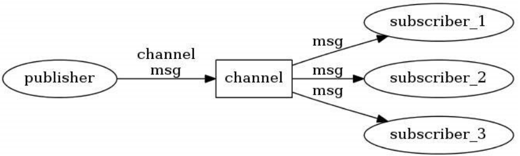
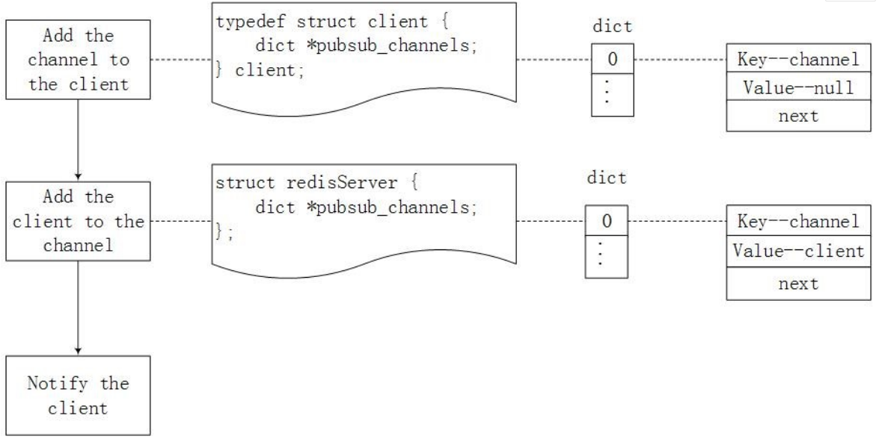
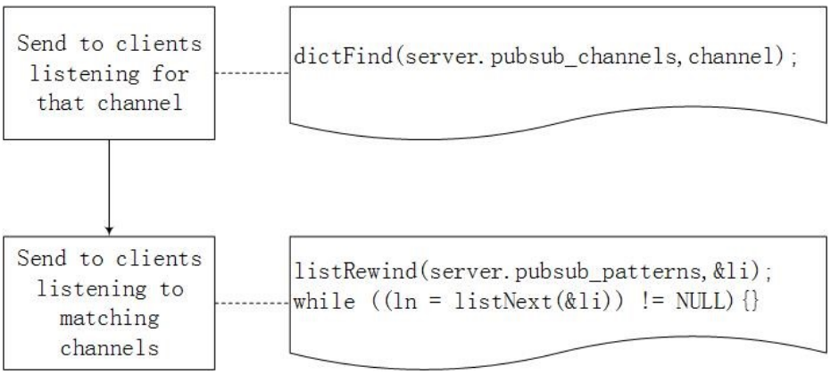
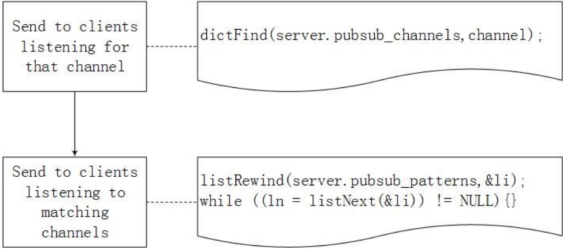
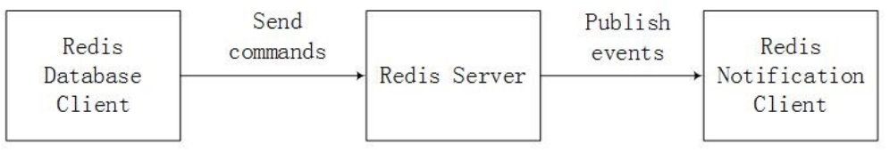

## Introduction of PubSub
Here is the introduction from [redis.io](https://redis.io/topics/pubsub)

SUBSCRIBE, UNSUBSCRIBE and PUBLISH implement the Publish/Subscribe messaging paradigm where (citing Wikipedia) senders (publishers) are not programmed to send their messages to specific receivers (subscribers). Rather, published messages are characterized into channels, without knowledge of what (if any) subscribers there may be. Subscribers express interest in one or more channels, and only receive messages that are of interest, without knowledge of what (if any) publishers there are. This decoupling of publishers and subscribers can allow for greater scalability and a more dynamic network topology.

## Implementation
#### SUBSCRIBE 

When a client subscirbes a channel, redis need to bind the channel and the client together.
#### PSUBSCRIBE 

When a client want to get messages from a channel model, redis need to bind the channel and the client together too.

#### PUBLISH
 
Send messages to clients

#### Architecture

