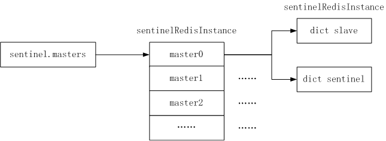

## Introduction of Sentinel
[Redis Sentinel](https://redis.io/topics/sentinel) provides high availability for Redis. In practical terms this means that using Sentinel you can create a Redis deployment that resists without human intervention to certain kind of failures.

Redis Sentinel also provides other collateral tasks such as monitoring, notifications and acts as a configuration provider for clients.

This is the full list of Sentinel capabilities at a macroscopical level (i.e. the big picture):

- Monitoring. Sentinel constantly checks if your master and slave instances are working as expected.
- Notification. Sentinel can notify the system administrator, another computer programs, via an API, that something is wrong with one of the monitored Redis instances.
- Automatic failover. If a master is not working as expected, Sentinel can start a failover process where a slave is promoted to master, the other additional slaves are reconfigured to use the new master, and the applications using the Redis server informed about the new address to use when connecting.
- Configuration provider. Sentinel acts as a source of authority for clients service discovery: clients connect to Sentinels in order to ask for the address of the current Redis master responsible for a given service. If a failover occurs, Sentinels will report the new address.

##### Distributed nature of Sentinel
[Redis Sentinel](https://redis.io/topics/sentinel) is a distributed system:

Sentinel itself is designed to run in a configuration where there are multiple Sentinel processes cooperating together. The advantage of having multiple Sentinel processes cooperating are the following:

Failure detection is performed when multiple Sentinels agree about the fact a given master is no longer available. This lowers the probability of false positives.
Sentinel works even if not all the Sentinel processes are working, making the system robust against failures. There is no fun in having a fail over system which is itself a single point of failure, after all.
The sum of Sentinels, Redis instances (masters and slaves) and clients connecting to Sentinel and Redis, are also a larger distributed system with specific properties. In this document concepts will be introduced gradually starting from basic information needed in order to understand the basic properties of Sentinel, to more complex information (that are optional) in order to understand how exactly Sentinel works.

