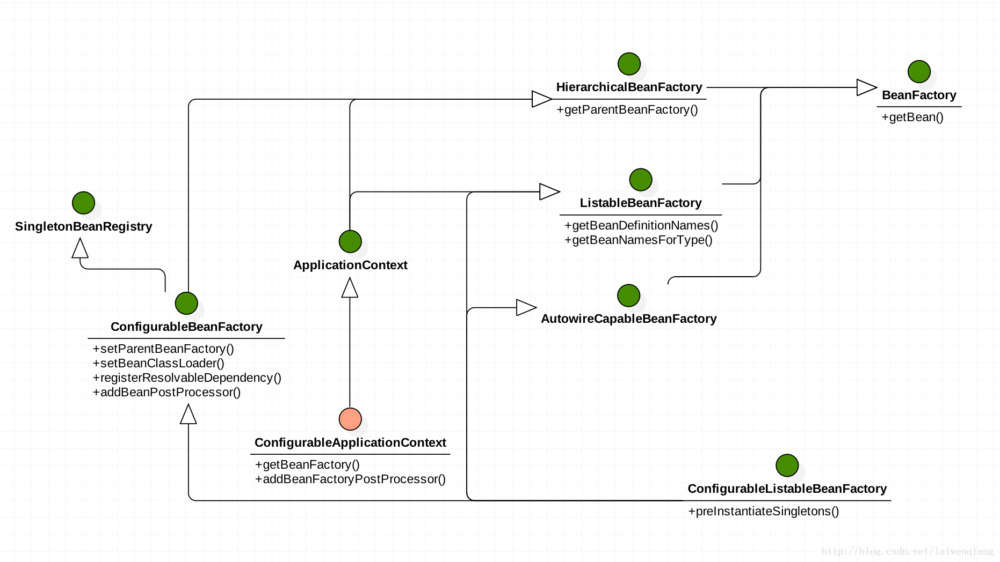

  
## Relationship of Main Interfaces in Spring

## BeanFactory Design Route
BeanFactory -> HierarchicalBeanFactory -> ConfigurableBeanFactory is the main BeanFactory design route.

- BeanFactory: Basic rules like getBean() function
- HierarchicalBeanFactory: Manage family IoC container like getParentBeanFactory() function
- ConfigurableBeanFactory: config of BeanFactory like using setParentBeanFactory() to set family IoC container

## ApplicationContext Design Route
BeanFactory -> ListableBeanFactory and HierarchicalBeanFactory -> ApplicationContext -> ConfigurableApplicationContext is the main ApplicationContext design route。

ListableBeanFactory: Let function of BeanFactory be more usefull like getBeanDefinitionNames()
ApplicationContext: Implements MessageSource, ResourceLoader and ApplicationEventPublisher interface to add more functions