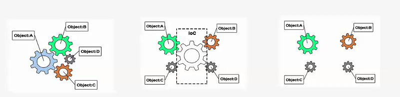

One of the most important part in SpringFramework is IoC. Here let's see what it is.

## Introduction to the Spring IoC container and beans
IoC(Inversion of Control) is a kind of design, and DI is one of its implements. Without IoC, dependency among beans will be coded in program, and the creating bean will control it. After IoC, the control will be done by the another one: which means the way to get beans has been inverted.

In Spring, it works like the following:

We use configuration metadata to define which POJO will be put into the Spring Container.

