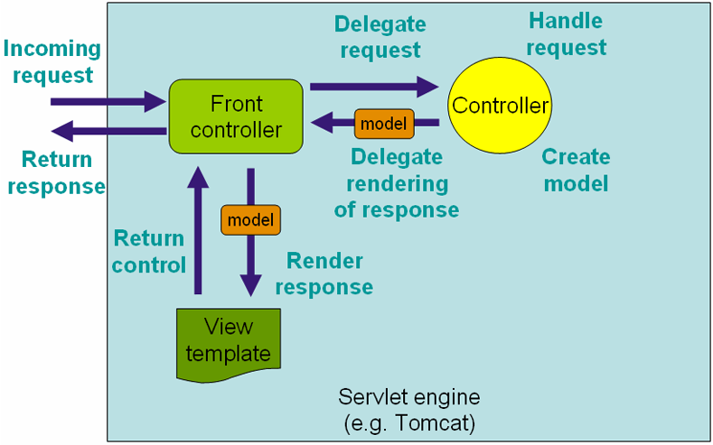

## Introduction of @RequestMapping
The @RequestMapping  is one of the most popular annotations. It will mapping HTTP request to the right function of the right controller. In srpingMVC, the RequestDispatcher is responsible for rooting HTTP request to the right function. So, when setting springMVC we need to set the mapping.  

For setting the mapping we use the @RequestMapping annotation. The @RequestMapping can be used on a class or a function. 
 
In the springMVC there are 6 types of params:

- value: the request URL
- method: method type of request like GET, POST, PUT, DELETE and so on.
- consumes: define the Content-Type of request like application/json, text/html and so on
- produces: define the type of return when the request contains the Accept
- params: fucntion will be invoked only when the contition of params is satisfied
- headers:  fucntion will be invoked only when the header of request is satisfied

## Example

#### value  && method

	@Controller  
	@RequestMapping("/appointments")  
	public class AppointmentsController {  
	  
	    private AppointmentBook appointmentBook;  
	      
	    @Autowired  
	    public AppointmentsController(AppointmentBook appointmentBook) {  
	        this.appointmentBook = appointmentBook;  
	    }  
	  
	    @RequestMapping(method = RequestMethod.GET)  
	    public Map<String, Appointment> get() {  
	        return appointmentBook.getAppointmentsForToday();  
	    }  
	  
	    @RequestMapping(value="/{day}", method = RequestMethod.GET)  
	    public Map<String, Appointment> getForDay(@PathVariable @DateTimeFormat(iso=ISO.DATE) Date day, Model model) {  
	        return appointmentBook.getAppointmentsForDay(day);  
	    }  
	  
	    @RequestMapping(value="/new", method = RequestMethod.GET)  
	    public AppointmentForm getNewForm() {  
	        return new AppointmentForm();  
	    }  
	  
	    @RequestMapping(method = RequestMethod.POST)  
	    public String add(@Valid AppointmentForm appointment, BindingResult result) {  
	        if (result.hasErrors()) {  
	            return "appointments/new";  
	        }  
	        appointmentBook.addAppointment(appointment);  
	        return "redirect:/appointments";  
	    }  
	}

URI of value has 3 types:

- normal value
- URI Template Patterns with Path Variables
- URI Template Patterns with Regular Expressions

##### example B)

	@RequestMapping(value="/owners/{ownerId}", method=RequestMethod.GET)  
	public String findOwner(@PathVariable String ownerId, Model model) {  
	  Owner owner = ownerService.findOwner(ownerId);    
	  model.addAttribute("owner", owner);    
	  return "displayOwner";   
	}
  
##### example C)
	
	@RequestMapping("/spring-web/{symbolicName:[a-z-]+}-{version:\d\.\d\.\d}.{extension:\.[a-z]}")  
	  public void handle(@PathVariable String version, @PathVariable String extension) {      
	    // ...  
	  }  
	}

#### consumes && produces
##### cousumes example

	@Controller  
	@RequestMapping(value = "/pets", method = RequestMethod.POST, consumes="application/json")  
	public void addPet(@RequestBody Pet pet, Model model) {      
	    // implementation omitted  
	} 

Only when the request Content-Type is "application/json" then the function will be invoked.

##### produces example

	@Controller  
	@RequestMapping(value = "/pets/{petId}", method = RequestMethod.GET, produces="application/json")  
	@ResponseBody  
	public Pet getPet(@PathVariable String petId, Model model) {      
	    // implementation omitted  
	}

Only when the Accept of the request has "application/json" then the function will be invoked and the type of return will be "application/json".
  
#### params && headers
##### params example
	
	@Controller  
	@RequestMapping("/owners/{ownerId}")  
	public class RelativePathUriTemplateController {  
	  
	  @RequestMapping(value = "/pets/{petId}", method = RequestMethod.GET, params="myParam=myValue")  
	  public void findPet(@PathVariable String ownerId, @PathVariable String petId, Model model) {      
	    // implementation omitted  
	  }  
	}

Only a request with a "myParam" and its value is "myValue" will be invoked.

##### headers example

	@Controller  
	@RequestMapping("/owners/{ownerId}")  
	public class RelativePathUriTemplateController {  
	  
	@RequestMapping(value = "/pets", method = RequestMethod.GET, headers="Referer=http://www.ifeng.com/")  
	  public void findPet(@PathVariable String ownerId, @PathVariable String petId, Model model) {      
	    // implementation omitted  
	  }  
	}

Only when the header of the request contains "Refer" whose value is "http://www.ifeng.com/" then the function will be invoked.